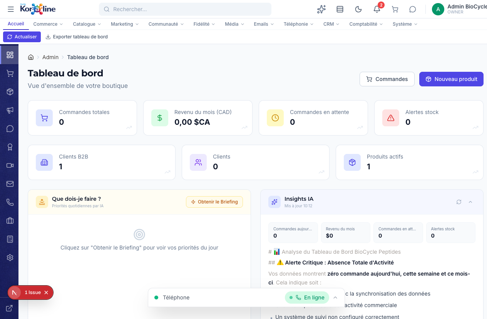

# Tableau de Bord

> **Section**: Tableau de bord
> **URL**: `/admin/dashboard`
> **Niveau**: Debutant
> **Temps de lecture**: ~15 minutes

---

## A quoi sert cette page ?

Le **Tableau de bord** est la premiere page que vous voyez en vous connectant a l'administration Koraline. C'est votre vue d'ensemble quotidienne : combien de commandes, combien de revenus, quelles alertes necessitent votre attention.

**En un coup d'oeil, vous voyez :**
- Le nombre de commandes totales et en attente
- Le revenu du mois en dollars canadiens
- Le nombre d'alertes de stock
- Le nombre de clients B2B et individuels
- Le nombre de produits actifs
- Les priorites du jour (via le briefing IA)
- Les insights IA (analyse automatique de vos donnees)

---

## Comment y acceder

Le tableau de bord est la **page par defaut** apres la connexion. Vous pouvez aussi y revenir a tout moment :

### Methode 1 : Cliquer sur le logo
Cliquez sur le logo **Kor@line** en haut a gauche.

### Methode 2 : Via le rail de navigation
Cliquez sur la premiere icone (grille de 4 carres) dans la colonne d'icones a gauche.

### Methode 3 : Via l'onglet Accueil
Cliquez sur **Accueil** dans la barre de navigation horizontale en haut.

---

## Vue d'ensemble de l'interface

### La barre de ruban

| Bouton | Fonction |
|--------|----------|
| **Actualiser** | Recharger toutes les donnees du tableau de bord |
| **Exporter tableau de bord** | Telecharger un resume en CSV ou PDF |

### Les cartes de statistiques (7 indicateurs)

**Ligne 1 — Activite commerciale :**

| Carte | Description |
|-------|-------------|
| **Commandes totales** | Nombre de commandes recues depuis le debut |
| **Revenu du mois (CAD)** | Total des ventes du mois en cours, en dollars canadiens |
| **Commandes en attente** | Commandes pas encore traitees (a expedier) |
| **Alertes stock** | Nombre de produits en stock bas ou en rupture |

**Ligne 2 — Base de donnees :**

| Carte | Description |
|-------|-------------|
| **Clients B2B** | Nombre de distributeurs/ambassadeurs inscrits |
| **Clients** | Nombre de clients individuels (B2C) |
| **Produits actifs** | Nombre de produits publies sur la boutique |

Chaque carte a une petite icone de graphique qui, en cliquant, montre la tendance.

### Raccourcis rapides (en haut a droite)

| Bouton | Fonction |
|--------|----------|
| **Commandes** | Aller directement a la page des commandes |
| **Nouveau produit** | Creer un nouveau produit immediatement |

---

## Fonctions detaillees

### 1. Briefing IA quotidien

Le bloc **"Que dois-je faire ?"** a gauche est votre assistant de priorites :

1. Cliquez sur **Obtenir le Briefing**
2. L'IA analyse vos donnees (commandes en attente, stock bas, emails non lus, etc.)
3. Elle vous donne une liste de priorites pour la journee

**Exemple de briefing :**
- "2 commandes en attente depuis plus de 24h — a traiter en priorite"
- "Stock de BPC-157 sous le seuil d'alerte — commander chez le fournisseur"
- "3 avis clients non moderes — a approuver ou rejeter"

### 2. Insights IA

Le bloc **"Insights IA"** a droite fournit une analyse automatique :
- Mini-cartes avec commandes du jour, revenu du mois, commandes en attente, alertes stock
- Analyse textuelle : que signifient les chiffres ? quelles actions recommandees ?
- Mis a jour automatiquement (l'heure de derniere mise a jour est affichee)

Les insights incluent :
- Analyse des tendances de vente
- Detection d'anomalies (baisse soudaine, pic inhabituel)
- Recommandations concretes (reapprovisionner, lancer une promo, etc.)

### 3. Actualiser les donnees

Les donnees du tableau de bord sont chargees a l'ouverture. Pour les mettre a jour sans recharger la page :
1. Cliquez sur **Actualiser** dans la barre de ruban
2. Toutes les cartes se mettent a jour avec les donnees les plus recentes

### 4. Exporter le tableau de bord

1. Cliquez sur **Exporter tableau de bord** dans le ruban
2. Un fichier est telecharge avec toutes les statistiques affichees
3. Utile pour les rapports hebdomadaires ou les reunions d'equipe

---

## Workflows complets

### Scenario 1 : Routine matinale du gestionnaire

1. Connectez-vous a `/admin`
2. Le tableau de bord s'affiche automatiquement
3. Regardez les **commandes en attente** — si > 0, allez traiter les commandes
4. Verifiez les **alertes stock** — si > 0, planifiez un reapprovisionnement
5. Cliquez sur **Obtenir le Briefing** pour voir les priorites IA
6. Traitez les priorites dans l'ordre recommande

### Scenario 2 : Rapport hebdomadaire pour l'equipe

1. Chaque lundi, ouvrez le tableau de bord
2. Cliquez sur **Exporter tableau de bord**
3. Ouvrez le fichier dans Excel
4. Comparez avec la semaine precedente
5. Identifiez les tendances (hausse/baisse ventes, nouveaux clients)
6. Partagez avec l'equipe

---

## FAQ

### Q : Les donnees sont-elles en temps reel ?
**R** : Les donnees sont chargees a l'ouverture de la page. Pour obtenir les donnees les plus recentes, cliquez sur **Actualiser** dans le ruban.

### Q : Le revenu inclut-il les taxes ?
**R** : Oui, le "Revenu du mois" inclut les taxes. C'est le montant total facture aux clients.

### Q : Le briefing IA est-il fiable ?
**R** : Le briefing est base sur vos donnees reelles. Il identifie les priorites objectives (commandes en retard, stock bas). Les recommandations strategiques sont des suggestions, pas des obligations.

### Q : Puis-je personnaliser les cartes affichees ?
**R** : Pas encore. Les 7 cartes sont fixes. Une future mise a jour pourrait permettre la personnalisation.

---

## Glossaire

| Terme | Definition |
|-------|-----------|
| **B2B** | Business-to-Business — ventes entre entreprises (distributeurs, ambassadeurs) |
| **B2C** | Business-to-Consumer — ventes aux clients individuels |
| **CAD** | Dollar canadien |
| **Briefing IA** | Rapport de priorites genere automatiquement par l'intelligence artificielle |
| **Insights** | Analyses et tendances extraites automatiquement des donnees |
| **Alerte stock** | Notification quand un produit est en dessous de son seuil d'alerte |

---

## Pages liees

- [Commandes](../02-commerce/01-commandes.md) — Gerer les commandes en attente
- [Inventaire](../02-commerce/05-inventaire.md) — Traiter les alertes de stock
- [Produits](../03-catalogue/01-produits.md) — Voir les produits actifs
- [Clients](../02-commerce/02-clients.md) — Details des clients
