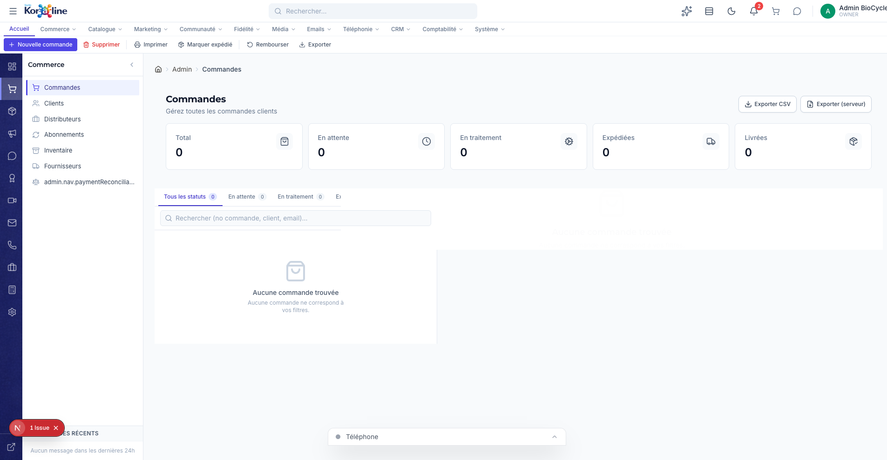

# Gestion des Commandes

> **Section**: Commerce > Commandes
> **URL**: `/admin/commandes`
> **Niveau**: Debutant a avance
> **Temps de lecture**: ~30 minutes

---

## A quoi sert cette page ?

La page **Commandes** est le coeur de votre activite commerciale. C'est ici que vous suivez, gerez et traitez TOUTES les commandes passees par vos clients sur la boutique BioCycle Peptides.

**En tant que gestionnaire, vous pouvez :**
- Voir toutes les commandes en un coup d'oeil, classees par date
- Filtrer par statut (en attente, en traitement, expediee, livree)
- Rechercher une commande specifique par numero, nom de client ou email
- Consulter le detail complet de chaque commande
- Changer le statut d'une commande au fil de son traitement
- Ajouter un numero de suivi du transporteur
- Rembourser une commande (totalement ou partiellement)
- Reexpedier une commande en cas de probleme
- Annuler une commande
- Exporter la liste des commandes en CSV pour votre comptabilite
- Envoyer un email de confirmation au client
- Ajouter des notes internes pour votre equipe
- Detecter les commandes potentiellement frauduleuses

---

## Comment y acceder

### Methode 1 : Via le menu principal
1. Connectez-vous a l'interface d'administration (`/admin`)
2. Dans la **barre de navigation horizontale** en haut, cliquez sur **Commerce**
3. Dans le **panneau lateral gauche** qui apparait, cliquez sur **Commandes**

### Methode 2 : Via le rail de navigation (icones a gauche)
1. Dans la colonne d'icones tout a gauche de l'ecran, cliquez sur l'icone **panier** (2e icone)
2. Le panneau "Commerce" s'ouvre avec la liste des sous-pages
3. Cliquez sur **Commandes**

### Methode 3 : Via le raccourci dans la barre d'outils
1. En haut a droite de l'ecran, il y a une icone de panier avec un lien direct vers les commandes
2. Cliquez dessus pour acceder directement a la page

### Methode 4 : Via la barre de recherche
1. Cliquez sur la barre de recherche en haut au centre (ou tapez `/`)
2. Tapez "commandes"
3. Selectionnez le resultat

> **Astuce**: La page Commandes est probablement celle que vous visiterez le plus souvent. Mettez-la en favoris dans votre navigateur !

---

## Vue d'ensemble de l'interface



L'interface est divisee en **5 zones principales** :

### 1. La barre de ruban (Ribbon) — en haut
C'est la barre d'outils contextuelle qui change selon la page. Pour les commandes, elle contient :

| Bouton | Icone | Fonction |
|--------|-------|----------|
| **Nouvelle commande** | + vert | Creer manuellement une commande (pour les commandes telephoniques ou speciales) |
| **Supprimer** | Poubelle rouge | Supprimer la commande selectionnee (action irreversible !) |
| **Imprimer** | Imprimante | Imprimer le bon de commande ou le recapitulatif |
| **Marquer expedie** | Camion | Changer le statut de la commande en "Expediee" |
| **Rembourser** | Fleche retour | Ouvrir la fenetre de remboursement |
| **Exporter** | Telecharger | Exporter les commandes filtrees au format CSV |

### 2. Le panneau de navigation (sidebar gauche)
Affiche les sous-pages de la section Commerce :
- **Commandes** (page actuelle)
- **Clients** — les acheteurs individuels
- **Distributeurs** — les clients B2B
- **Abonnements** — les commandes recurrentes
- **Inventaire** — niveaux de stock
- **Fournisseurs** — vos fournisseurs
- **Reconciliation paiements** — rapprochement bancaire

### 3. Les cartes de statistiques
5 cartes resumant l'etat de vos commandes :

| Carte | Description |
|-------|-------------|
| **Total** | Nombre total de commandes dans le systeme |
| **En attente** | Commandes recues mais pas encore confirmees |
| **En traitement** | Commandes confirmees, en cours de preparation |
| **Expediees** | Commandes envoyees au transporteur |
| **Livrees** | Commandes recues par le client |

> **Comprendre les statuts**: Une commande suit ce parcours :
> `En attente` → `Confirmee` → `En traitement` → `Expediee` → `Livree`
> A tout moment, elle peut etre `Annulee`.

### 4. La liste des commandes (panneau central)
C'est la zone principale. Les commandes sont affichees dans une liste avec :
- **Onglets de filtrage** : Tous les statuts, En attente, En traitement, Expediee, Livree
- **Barre de recherche** : Recherchez par numero de commande, nom du client ou email
- **Groupement par date** : Les commandes sont automatiquement groupees en "Aujourd'hui", "Hier", "Cette semaine", "Plus ancien"
- **Badge de statut** : Chaque commande affiche son statut colore (jaune = en attente, bleu = en traitement, vert = livree, rouge = annulee)
- **Indicateur de fraude** : Un badge colore indique le niveau de risque de fraude detecte automatiquement
- **Tags automatiques** : Des etiquettes colorees sont ajoutees automatiquement (ex: "Gros panier", "International", "Promo utilisee")

### 5. Le panneau de detail (panneau droit)
Quand vous cliquez sur une commande dans la liste, ses details complets s'affichent a droite :
- Informations du client
- Adresse de livraison
- Liste des articles commandes avec quantites et prix
- Resume financier (sous-total, livraison, taxes, remise, total)
- Statut et historique (timeline)
- Notes internes
- Actions disponibles

---

## Fonctionnalites detaillees

### 1. Consulter une commande

**Objectif** : Voir tous les details d'une commande specifique.

**Etapes** :
1. Dans la liste des commandes, **cliquez sur la commande** que vous souhaitez consulter
2. Le panneau de detail s'ouvre a droite de l'ecran
3. Vous voyez :
   - **En-tete** : Numero de commande (ex: `ORD-2026-0042`), date, statut
   - **Client** : Nom, email, lien vers sa fiche client
   - **Adresse** : Adresse de livraison complete
   - **Articles** : Tableau avec chaque produit, format, quantite, prix unitaire et total
   - **Resume financier** :
     - Sous-total (avant taxes et livraison)
     - Frais de livraison
     - Remise (si code promo utilise)
     - TPS (5%), TVQ (9.975%) ou TVH selon la province
     - **Total final**
   - **Timeline** : Chronologie visuelle de la commande (creation, paiement, expedition, etc.)
   - **Notes** : Notes internes de l'equipe

**Ce que vous voyez dans le resume financier** :
```
Sous-total :          89,95 $CA
Livraison :           12,00 $CA
Code promo (BIENVENUE10) : -10,00 $CA
TPS (5%) :             4,60 $CA
TVQ (9.975%) :         9,17 $CA
─────────────────────────────────
Total :              105,72 $CA
```

> **Pour les neophytes** : La TPS (Taxe sur les Produits et Services) est une taxe federale canadienne de 5%. La TVQ (Taxe de Vente du Quebec) est de 9.975%. Ensemble, elles totalisent ~14.975% de taxes au Quebec.

---

### 2. Changer le statut d'une commande

**Objectif** : Faire progresser une commande dans le processus de traitement.

**Quand l'utiliser** :
- Vous venez de confirmer le paiement → passez de "En attente" a "Confirmee"
- Vous commencez a preparer le colis → passez a "En traitement"
- Vous avez remis le colis au transporteur → passez a "Expediee"
- Le client a recu son colis → passez a "Livree"
- Le client demande une annulation → passez a "Annulee"

**Etapes** :
1. Selectionnez la commande dans la liste
2. Dans le panneau de detail, trouvez la section **Statut**
3. Cliquez sur le menu deroulant du statut
4. Selectionnez le nouveau statut
5. Confirmez le changement

**Ou via le ruban** :
1. Selectionnez la commande
2. Cliquez sur **Marquer expedie** dans le ruban pour passer directement au statut "Expediee"

> **Important** : Le changement de statut est enregistre dans la timeline de la commande. Le client peut recevoir une notification automatique (selon vos parametres).

> **Attention** : Annuler une commande est une action serieuse. Si le paiement a deja ete encaisse, vous devrez aussi proceder a un remboursement.

---

### 3. Ajouter un numero de suivi (tracking)

**Objectif** : Associer un numero de suivi du transporteur a une commande expediee, pour que le client puisse suivre son colis.

**Quand l'utiliser** : Apres avoir remis le colis au transporteur (Postes Canada, UPS, FedEx, Purolator, etc.)

**Etapes** :
1. Selectionnez la commande concernee
2. Dans le panneau de detail, trouvez la section **Expedition**
3. Remplissez :
   - **Transporteur** : Le nom du transporteur (ex: "Postes Canada", "UPS", "FedEx")
   - **Numero de suivi** : Le numero de tracking fourni par le transporteur (ex: "1Z999AA10123456784")
4. Cliquez sur **Sauvegarder**

Le numero de suivi sera :
- Affiche dans la timeline de la commande
- Visible par le client dans son espace "Mes commandes"
- Inclus dans l'email de notification d'expedition (si configure)

> **Astuce** : Collez le numero de suivi directement depuis le site du transporteur. Evitez les espaces en debut ou fin de texte.

---

### 4. Rembourser une commande

**Objectif** : Rendre tout ou partie du montant paye par le client.

**Quand l'utiliser** :
- Le client n'est pas satisfait et retourne le produit
- Vous avez envoye le mauvais produit
- Le produit est arrive endommage
- Le client a ete facture par erreur
- Annulation apres paiement

**Etapes** :
1. Selectionnez la commande a rembourser
2. Cliquez sur **Rembourser** dans le ruban (ou dans le panneau de detail)
3. La fenetre de remboursement s'ouvre avec :
   - **Montant** : Pre-rempli avec le total de la commande. Vous pouvez modifier pour un remboursement partiel.
   - **Raison** : Obligatoire. Expliquez pourquoi vous remboursez (ex: "Produit defectueux retourne par le client")
4. Verifiez les informations
5. Cliquez sur **Confirmer le remboursement**

**Ce qui se passe** :
- Une **note de credit** est automatiquement creee en comptabilite
- Le remboursement est enregistre dans la timeline
- Le statut de paiement passe a "Rembourse" (total) ou "Rembourse partiellement" (partiel)
- Si Stripe est configure, le remboursement est traite automatiquement sur la carte du client

> **Remboursement total vs partiel** :
> - **Total** : Vous remboursez 100% du montant. Utilisez le montant pre-rempli.
> - **Partiel** : Modifiez le montant. Par exemple, remboursez 50$ sur une commande de 100$ si un seul des deux produits est retourne.

> **Attention** : Un remboursement ne peut pas etre annule. Verifiez bien le montant avant de confirmer.

---

### 5. Reexpedier une commande

**Objectif** : Creer une nouvelle expedition pour remplacer une commande problematique.

**Quand l'utiliser** :
- Le colis a ete perdu par le transporteur
- Le colis est arrive endommage
- Vous avez envoye le mauvais produit
- Le colis a ete vole apres livraison

**Etapes** :
1. Selectionnez la commande originale
2. Cliquez sur le bouton de **Reexpedition** dans le panneau de detail
3. Selectionnez la raison parmi :
   - Colis perdu pendant le transport
   - Colis endommage a la reception
   - Mauvais produit envoye
   - Colis vole apres livraison
   - Autre raison
4. Confirmez la reexpedition

**Ce qui se passe** :
- Une **nouvelle commande de remplacement** est creee automatiquement
- Elle est liee a la commande originale (visible dans la timeline)
- Le client n'est PAS facture a nouveau
- La commande de remplacement suit son propre cycle de statuts

---

### 6. Annuler une commande

**Objectif** : Annuler une commande qui ne doit plus etre traitee.

**Quand l'utiliser** :
- Le client demande l'annulation avant l'expedition
- Le produit est en rupture de stock
- Le paiement a echoue ou est suspect
- Commande en double

**Etapes** :
1. Selectionnez la commande a annuler
2. Un dialogue de confirmation apparait : "Etes-vous sur de vouloir annuler cette commande ?"
3. Confirmez l'annulation

> **Important** : Si le paiement a deja ete encaisse, annuler la commande NE rembourse PAS automatiquement le client. Vous devez aussi faire un remboursement (voir section 4).

---

### 7. Exporter les commandes en CSV

**Objectif** : Telecharger un fichier CSV de vos commandes pour l'analyser dans Excel, Google Sheets, ou l'importer dans votre logiciel de comptabilite.

**Deux options d'export** :

#### Option A : Export CSV (navigateur)
1. Appliquez vos filtres si necessaire (par statut, par recherche)
2. Cliquez sur **Exporter CSV** en haut a droite
3. Le fichier se telecharge automatiquement
4. Ouvrez-le avec Excel ou Google Sheets

**Colonnes exportees** :
| Colonne | Description |
|---------|-------------|
| Order # | Numero de commande |
| Date | Date de creation |
| Customer | Nom du client |
| Email | Adresse email |
| Status | Statut actuel |
| Payment | Statut du paiement |
| Subtotal | Sous-total avant taxes |
| Shipping | Frais de livraison |
| Discount | Montant de la remise |
| Tax | Montant total des taxes |
| Total | Montant total TTC |
| Currency | Devise (CAD) |
| Carrier | Transporteur |
| Tracking | Numero de suivi |
| Items | Nombre d'articles |

#### Option B : Export serveur
1. Cliquez sur **Exporter (serveur)** en haut a droite
2. L'export est genere cote serveur (plus fiable pour les gros volumes)
3. Le fichier se telecharge quand il est pret

> **Quelle option choisir ?**
> - Moins de 500 commandes → Export CSV (navigateur) suffit
> - Plus de 500 commandes → Utilisez Export serveur

---

### 8. Envoyer un email de confirmation

**Objectif** : Renvoyer l'email de confirmation de commande au client.

**Quand l'utiliser** :
- Le client dit ne pas avoir recu son email de confirmation
- Vous avez modifie des informations et voulez envoyer une mise a jour
- Le premier envoi a echoue

**Etapes** :
1. Selectionnez la commande
2. Dans le panneau de detail, cliquez sur l'icone **email** (enveloppe)
3. Confirmez l'envoi
4. Un message de succes s'affiche : "Email de confirmation envoye"

---

### 9. Ajouter une note interne

**Objectif** : Laisser un commentaire visible uniquement par l'equipe admin (invisible pour le client).

**Quand l'utiliser** :
- Signaler un probleme avec la commande a un collegue
- Noter une conversation telephonique avec le client
- Documenter une decision prise (ex: "Remise exceptionnelle accordee par la direction")

**Etapes** :
1. Selectionnez la commande
2. Cliquez sur le bouton **Ajouter une note**
3. Tapez votre commentaire
4. Cliquez sur **Sauvegarder**

La note est :
- Horodatee automatiquement (date et heure)
- Visible dans la timeline de la commande
- Persistante (ne peut pas etre supprimee)

---

### 10. Rechercher une commande

**Objectif** : Trouver rapidement une commande specifique.

**Methodes de recherche** :

| Vous cherchez par... | Tapez dans la barre de recherche... |
|----------------------|-------------------------------------|
| Numero de commande | `ORD-2026-0042` ou juste `0042` |
| Nom du client | `Jean Dupont` ou `dupont` |
| Email du client | `jean@email.com` ou `jean` |

La recherche est **instantanee** (pas besoin d'appuyer sur Entree) et **insensible a la casse** (majuscules/minuscules ignorees).

---

### 11. Filtrer par statut

**Objectif** : Voir uniquement les commandes d'un certain statut.

**Etapes** :
1. Sous les cartes de statistiques, vous voyez les onglets de filtrage
2. Cliquez sur l'onglet souhaite :
   - **Tous les statuts** : Affiche tout
   - **En attente** : Commandes en attente de confirmation
   - **En traitement** : Commandes en cours de preparation
   - **Expediee** : Commandes envoyees
   - **Livree** : Commandes recues par le client

Le compteur a cote de chaque onglet indique le nombre de commandes dans ce statut.

> **Workflow quotidien recommande** :
> 1. Le matin, filtrez sur **En attente** → Confirmez les nouvelles commandes
> 2. Preparez les colis → Passez-les en **En traitement**
> 3. Apres depot au transporteur → Passez-les en **Expediee** + ajoutez le tracking
> 4. Quand le suivi indique "Livre" → Passez en **Livree**

---

### 12. Detection de fraude

**Objectif** : Le systeme detecte automatiquement les commandes suspectes.

**Comment ca marche** :
Le systeme analyse chaque commande et lui attribue un **niveau de risque** :

| Niveau | Badge | Signification |
|--------|-------|---------------|
| **Bas** | Vert | Tout semble normal. Aucune action necessaire. |
| **Moyen** | Jaune | Quelques indicateurs suspects. Verifiez manuellement avant d'expedier. |
| **Haut** | Orange | Plusieurs signaux d'alerte. Verifiez soigneusement : contactez le client, verifiez l'adresse. |
| **Critique** | Rouge | Tres forte probabilite de fraude. NE PAS expedier sans verification approfondie. |

**Indicateurs analyses** :
- Montant anormalement eleve
- Adresse de livraison dans un pays a risque
- Email utilisant un domaine jetable
- Premiere commande avec un tres gros montant
- Adresse de livraison et de facturation differentes

> **Que faire en cas de risque eleve ?**
> 1. Ne pas expedier immediatement
> 2. Verifier l'identite du client (appeler au telephone, verifier l'email)
> 3. Si la commande est legitime, procedez normalement
> 4. Si suspecte, annulez la commande et remboursez

---

### 13. Tags automatiques

**Objectif** : Les commandes sont automatiquement etiquetees pour faciliter le tri.

**Tags possibles** :
| Tag | Signification | Critere |
|-----|---------------|---------|
| Gros panier | Commande de valeur elevee | Total > seuil configure |
| International | Expedition hors Canada | Pays != CA |
| Promo | Code promo utilise | promoCode present |
| 1ere commande | Premier achat du client | Premiere commande detectee |
| B2B | Client distributeur | Type client = B2B |
| Remplacement | Commande de reexpedition | Liee a une commande parente |

Les tags sont affiches sous forme de petites etiquettes colorees a cote de chaque commande dans la liste.

---

### 14. Timeline de la commande

**Objectif** : Voir l'historique complet d'une commande dans l'ordre chronologique.

La timeline affiche automatiquement tous les evenements :
- Commande creee (date + nombre d'articles)
- Paiement recu (montant + devise)
- Commande en traitement
- Commande expediee (transporteur + numero de suivi)
- Commande livree
- Remboursement (si applicable, avec numero de note de credit)
- Notes internes ajoutees
- Reexpeditions liees

Chaque evenement affiche :
- Une icone representative
- Le titre de l'evenement
- La date et l'heure
- Des details supplementaires si disponibles

---

## Connexions inter-modules

La page Commandes est connectee a **8 autres modules** de l'application. Quand vous consultez une commande, vous pouvez voir des informations provenant de :

| Module | Ce que vous voyez |
|--------|-------------------|
| **Comptabilite** | Ecritures comptables generees automatiquement par la commande |
| **Fidelite** | Points gagnes par le client, niveau actuel, points utilises |
| **Marketing** | Code promo utilise, details de la promotion |
| **Emails** | Derniers emails envoyes au client pour cette commande |
| **Telephonie** | Appels recents lies a ce client |
| **CRM** | Deal associe a cette commande |
| **Catalogue** | Details actualises des produits commandes (prix actuel, stock) |
| **Communaute** | Avis laisses par le client sur les produits commandes |

---

## Scenarios concrets

### Scenario A : Traiter une nouvelle commande (de A a Z)

1. **Matin** : Ouvrez la page Commandes, filtrez sur "En attente"
2. **Verifiez** la commande : montant coherent, adresse valide, pas de fraude
3. **Confirmez** : Passez le statut a "Confirmee"
4. **Preparez** : Rassemblez les produits, passez a "En traitement"
5. **Emballez** et deposez chez le transporteur
6. **Expediez** : Passez a "Expediee", ajoutez le tracking
7. **Envoyez** un email de confirmation avec le tracking
8. **Attendez** la livraison
9. **Finalisez** : Quand le suivi confirme la livraison, passez a "Livree"

### Scenario B : Gerer un retour / remboursement

1. Le client vous contacte (chat, email, telephone)
2. Ouvrez sa commande via la recherche
3. Evaluez la situation (ajoutez une note interne)
4. Si le retour est justifie :
   - Cliquez sur **Rembourser**
   - Saisissez le montant (total ou partiel)
   - Indiquez la raison
   - Confirmez
5. Si le client souhaite un remplacement :
   - Cliquez sur **Reexpedier** plutot que rembourser
   - Selectionnez la raison

### Scenario C : Commande suspecte (fraude)

1. Vous voyez un badge **rouge** (Critique) ou **orange** (Haut) sur une commande
2. NE PAS expedier
3. Verifiez l'email du client (domaine reel ? pas un email jetable ?)
4. Verifiez l'adresse de livraison (coherente avec la region du client ?)
5. Si necessaire, contactez le client par telephone
6. Si tout est en ordre : traitez normalement
7. Si suspect : annulez la commande et remboursez

---

## FAQ

**Q: Puis-je modifier les articles d'une commande apres qu'elle a ete passee ?**
R: Non, les articles d'une commande ne peuvent pas etre modifies directement. Si necessaire, annulez la commande et demandez au client d'en passer une nouvelle, ou creez une commande manuelle.

**Q: Le client dit qu'il n'a pas recu son email de confirmation. Que faire ?**
R: Selectionnez la commande et cliquez sur l'icone email pour renvoyer la confirmation.

**Q: Comment retrouver une commande si je n'ai que le nom du client ?**
R: Tapez le nom (ou une partie) dans la barre de recherche. La recherche fonctionne sur le nom, l'email et le numero de commande.

**Q: Que signifie le statut "En attente" ?**
R: La commande a ete passee mais n'a pas encore ete confirmee par l'equipe. C'est le premier statut apres la creation.

**Q: Puis-je annuler une commande deja expediee ?**
R: Techniquement oui dans le systeme, mais le colis est deja en route. Vous devrez contacter le transporteur pour tenter de le recuperer, ou attendre le retour et proceder au remboursement.

**Q: L'export CSV inclut-il les commandes filtrees ou toutes les commandes ?**
R: Uniquement les commandes visibles avec vos filtres actuels. Si vous voulez tout exporter, assurez-vous que l'onglet "Tous les statuts" est selectionne et que la recherche est vide.

---

## Strategie expert : Workflow de fulfillment complet

Le fulfillment (traitement et expedition) d'une commande BioCycle Peptides suit un cycle en 6 etapes. Chaque etape doit etre documentee dans la timeline de la commande pour assurer la tracabilite.

### Etape 1 : Reception et validation

Quand une commande arrive dans le systeme :
1. Verifier le paiement (statut Stripe confirme)
2. Verifier le risque de fraude (voir section Detection de fraude ci-dessus)
3. Verifier la disponibilite du stock dans **Commerce > Inventaire**
4. Valider l'adresse de livraison (format valide, code postal coherent avec la province/etat)
5. Passer le statut a **Confirmee**

**Temps cible** : moins de 2 heures apres reception pour les commandes recues avant 14h.

### Etape 2 : Picking (preparation)

1. Imprimer le bon de commande (bouton **Imprimer** dans le ruban)
2. Recuperer chaque produit dans l'entrepot selon le bon
3. Verifier le lot et la date d'expiration de chaque peptide
4. Scanner ou cocher chaque article pour confirmer la concordance
5. Passer le statut a **En traitement**

**Regle FIFO** : Toujours prelever les lots les plus anciens en premier (First In, First Out). Les peptides lyophilises ont une duree de conservation de 24 mois a partir de la fabrication.

### Etape 3 : Emballage

1. Utiliser un emballage isotherme pour les peptides lyophilises si la temperature ambiante depasse 25 degres Celsius
2. Inclure un sachet dessiccant pour l'humidite
3. Joindre le bon de livraison imprime (sans les prix si le client l'a demande)
4. Ajouter un insert marketing (carte de remerciement, code promo pour le prochain achat)
5. Sceller et etiqueter le colis

**Pour les envois internationaux** : inclure la facture commerciale (commercial invoice) avec la description douaniere des produits, le code SH (Systeme Harmonise) et la valeur declaree en dollars canadiens.

### Etape 4 : Expedition

1. Peser le colis et selectionner le service de transport optimal
2. Generer l'etiquette d'expedition via le portail du transporteur
3. Coller l'etiquette sur le colis
4. Deposer chez le transporteur ou programmer un ramassage
5. Passer le statut a **Expediee** et saisir le numero de suivi

### Etape 5 : Suivi post-expedition

1. Verifier quotidiennement les numeros de suivi en attente de livraison
2. Contacter proactivement le client si un colis est bloque en transit depuis plus de 5 jours ouvrables (Canada) ou 10 jours ouvrables (international)
3. Pour les envois avec assurance : conserver la preuve d'envoi pendant 90 jours

### Etape 6 : Confirmation de livraison

1. Quand le suivi confirme la livraison, passer a **Livree**
2. Declencher l'email de satisfaction (J+3 apres livraison)
3. Demander un avis produit (J+7 apres livraison)

---

## Strategie expert : Gestion des retours et echanges

### Politique de retour recommandee pour les peptides

Les peptides de recherche ont des contraintes specifiques qui impactent la politique de retour :
- **Produits non ouverts, scelle intact** : retour accepte sous 30 jours, remboursement complet
- **Produits ouverts** : retour refuse pour des raisons de controle qualite et d'integrite du produit
- **Produits endommages a la reception** : remplacement gratuit avec preuve photographique (dans les 48 heures suivant la reception)
- **Erreur de commande (notre faute)** : remplacement gratuit + frais de retour a notre charge

### Processus de retour structure

1. Le client contacte le service client (email, telephone, chat)
2. Creer une note interne sur la commande avec les details du probleme
3. Si le retour est justifie : generer un numero de retour (Return Merchandise Authorization, RMA)
4. Envoyer les instructions de retour au client par email
5. A la reception du colis retourne : inspecter le produit
6. Si conforme : proceder au remboursement ou a l'echange
7. Si non conforme : contacter le client pour expliquer le refus

### Echanges

Pour un echange, utiliser la fonction **Reexpedier** de la commande originale. Cela cree une commande de remplacement liee, sans facturation supplementaire. L'historique complet reste visible dans la timeline.

---

## Strategie expert : Detection de fraude avancee

Au-dela des indicateurs automatiques du systeme, voici les signaux supplementaires a surveiller manuellement pour une boutique de peptides au Canada.

### Signaux de fraude specifiques au marche des peptides

| Signal | Niveau de risque | Action recommandee |
|--------|-----------------|---------------------|
| Adresse de livraison differente de l'adresse de facturation | Moyen | Verifier par telephone |
| Premiere commande superieure a 500 $CA | Eleve | Verification manuelle obligatoire |
| Email utilisant un domaine jetable (guerrillamail, tempmail, yopmail) | Eleve | Contacter par telephone avant expedition |
| Plusieurs commandes en moins de 24 heures, memes produits | Critique | Bloquer et verifier |
| Adresse de livraison vers une boite postale ou un point relais | Moyen | Acceptable si le reste est coherent |
| Carte de credit emise dans un pays different de l'adresse de livraison | Eleve | Verification 3D Secure obligatoire |
| Client demandant une livraison "urgente" avec changement d'adresse apres commande | Critique | Refuser le changement, verifier l'identite |

### Procedure de verification manuelle

1. Rechercher l'email du client dans votre base : est-ce un client existant ?
2. Verifier la coherence entre le nom sur la carte et le nom du compte
3. Appeler le numero de telephone fourni (un numero invalide est un signal critique)
4. Verifier l'adresse sur Google Maps (existe-t-elle physiquement ?)
5. Si doute persistant : demander une piece d'identite ou annuler la commande

### Cout de la fraude

Pour une entreprise de la taille de BioCycle Peptides, une seule retrofacturation (chargeback) coute en moyenne :
- Le montant de la commande (perte seche)
- 15 $CA a 25 $CA de frais de retrofacturation Stripe
- Le cout des produits expedies (non recuperables)
- Un impact negatif sur le ratio de retrofacturation (si superieur a 1%, Stripe peut suspendre le compte)

---

## Strategie expert : Expedition internationale et frais de douane

### Delais de livraison typiques depuis le Quebec

| Destination | Transporteur recommande | Delai moyen | Fourchette de prix |
|-------------|------------------------|-------------|-------------------|
| Quebec/Ontario | Postes Canada Expedie | 2-3 jours ouvrables | 12-18 $CA |
| Autres provinces canadiennes | Postes Canada Expedie | 3-5 jours ouvrables | 15-22 $CA |
| Etats-Unis (zone continentale) | Postes Canada Petit paquet USA / UPS Standard | 5-8 jours ouvrables | 18-35 $CA |
| Europe (UE) | Postes Canada Petit paquet international | 10-15 jours ouvrables | 25-45 $CA |
| Australie / Asie | Postes Canada Petit paquet international | 12-20 jours ouvrables | 30-55 $CA |
| Express international | FedEx / UPS Express | 3-5 jours ouvrables | 55-120 $CA |

### Calcul des frais de douane pour les peptides

Les peptides synthetiques pour usage en recherche sont classes sous des codes douaniers specifiques. Les regles varient par pays.

**Vers les Etats-Unis** :
- Seuil de minimis : 800 $US (commandes en dessous ne paient pas de droits)
- La plupart des peptides de recherche passent sans droits additionnels
- Declaration douaniere : "Synthetic peptides for research use only, not for human consumption"
- Code SH suggere : 2933.99 (composes heterocycliques) ou 3002.19 (produits de synthese peptidique)

**Vers l'Union europeenne** :
- Seuil de minimis : 150 EUR (au-dela, TVA + droits de douane)
- TVA applicable : 20% (France), 19% (Allemagne), 21% (Belgique) selon le pays
- Droits de douane typiques : 0 a 6,5% selon la classification exacte

**Vers l'Australie** :
- Seuil de minimis : 1 000 AUD (pas de droits en dessous)
- Attention : l'Australie a des restrictions strictes sur l'importation de certains peptides. Verifier la liste TGA (Therapeutic Goods Administration) avant d'expedier.

### Documents requis pour l'expedition internationale

1. **Facture commerciale** (commercial invoice) : obligatoire pour tout envoi hors Canada
2. **Declaration de contenu** : description precise des produits, valeur, pays d'origine
3. **Certificat d'analyse (COA)** : recommande pour les douanes, prouve la nature du produit
4. **Mention "For research use only"** : obligatoire sur tous les documents et etiquettes

---

## Glossaire

| Terme | Definition |
|-------|-----------|
| **Commande** | Un achat effectue par un client, comprenant un ou plusieurs produits |
| **Statut** | L'etape actuelle de la commande dans le processus de traitement |
| **Paiement** | Le reglement financier associe a la commande (par carte de credit via Stripe) |
| **Tracking** | Le numero de suivi fourni par le transporteur pour localiser le colis |
| **Note de credit** | Un document comptable cree lors d'un remboursement |
| **TPS** | Taxe sur les Produits et Services (taxe federale canadienne, 5%) |
| **TVQ** | Taxe de Vente du Quebec (taxe provinciale, 9.975%) |
| **TVH** | Taxe de Vente Harmonisee (dans certaines provinces, combine TPS + taxe provinciale) |
| **CSV** | Comma-Separated Values — format de fichier tabulaire compatible avec Excel |
| **Fraude** | Commande passee avec une carte volee ou une identite usurpee |
| **Reexpedition** | Renvoi gratuit d'une commande en cas de probleme avec la livraison originale |
| **CSRF** | Protection de securite qui empeche les actions non autorisees (transparente pour l'utilisateur) |

---

## Pages liees

- [Clients (acheteurs)](/admin/customers) — Voir la fiche complete du client
- [Distributeurs B2B](/admin/clients) — Clients professionnels
- [Inventaire](/admin/inventaire) — Verifier les niveaux de stock
- [Reconciliation des paiements](/admin/paiements/reconciliation) — Rapprochement bancaire
- [Comptabilite](/admin/comptabilite) — Ecritures comptables generees par les commandes
