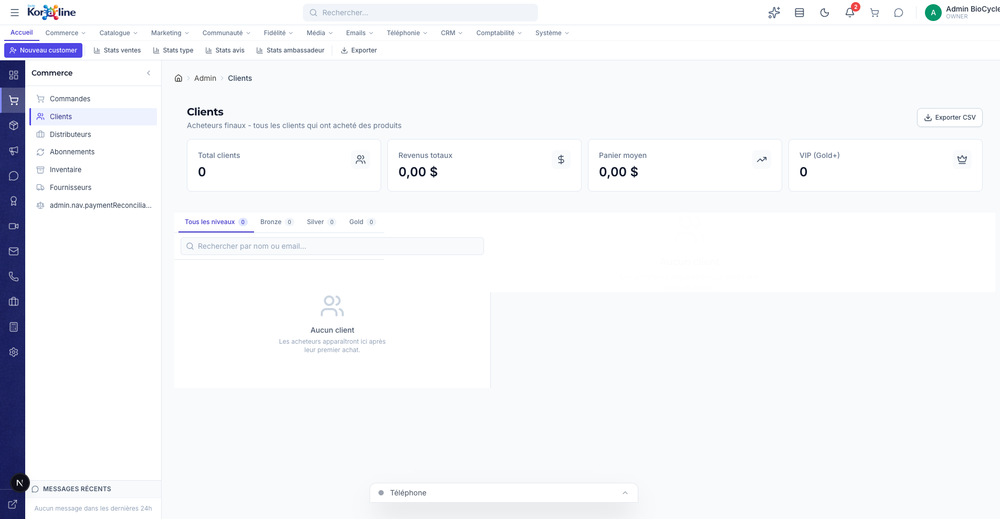

# Gestion des Clients (Acheteurs)

> **Section**: Commerce > Clients
> **URL**: `/admin/customers`
> **Niveau**: Debutant a avance
> **Temps de lecture**: ~25 minutes

---

## A quoi sert cette page ?

La page **Clients** regroupe tous les **acheteurs finaux** — c'est-a-dire toutes les personnes qui ont cree un compte ou passe une commande sur votre boutique BioCycle Peptides.

> **Difference entre Clients et Distributeurs** :
> - **Clients** (cette page) = les consommateurs individuels, le grand public
> - **Distributeurs** (`/admin/clients`) = les entreprises, revendeurs, partenaires B2B

**Ce que vous pouvez faire ici** :
- Voir la liste de tous vos clients avec leurs statistiques
- Filtrer par niveau de fidelite (Bronze, Silver, Gold, Platinum, Diamond)
- Rechercher un client par nom ou email
- Consulter la fiche complete d'un client (achats, points, niveau, segmentation)
- Analyser vos clients avec la segmentation RFM (outil marketing avance)
- Voir vos meilleurs clients VIP en un coup d'oeil
- Exporter la liste complete en CSV
- Consulter les statistiques globales de votre base clients

---

## Comment y acceder

1. Dans la barre de navigation, cliquez sur **Commerce**
2. Dans le panneau lateral, cliquez sur **Clients**

Ou directement via l'URL : `/admin/customers`

---

## Vue d'ensemble de l'interface



### Les 4 cartes de statistiques

| Carte | Description | Utilite |
|-------|-------------|---------|
| **Total clients** | Nombre total de clients inscrits | Mesure la taille de votre base clients |
| **Revenus totaux** | Somme de tous les achats de tous les clients | Chiffre d'affaires global genere par vos clients |
| **Panier moyen** | Montant moyen depense par client | Indicateur de la valeur moyenne d'un client |
| **VIP (Gold+)** | Nombre de clients Gold, Platinum ou Diamond | Vos meilleurs clients, ceux qui generent le plus de revenus |

### Les onglets de filtrage par niveau

Les clients sont classes automatiquement par niveau de fidelite selon leurs achats et leurs points :

| Niveau | Qui sont-ils | Comment y acceder |
|--------|-------------|-------------------|
| **Tous les niveaux** | Tous vos clients | Onglet par defaut |
| **Bronze** | Nouveaux clients ou achats occasionnels (0+ points) | Clients debutants |
| **Silver** | Clients reguliers (500+ points) | Acheteurs qui reviennent |
| **Gold** | Bons clients (2 000+ points) | Clients fideles |
| **Platinum** | Tres bons clients (5 000+ points) | Clients tres actifs |
| **Diamond** | Meilleurs clients (10 000+ points) | Top clients, VIP absolus |

> **Pour les neophytes** : Les points de fidelite s'accumulent automatiquement a chaque achat (1 point par dollar depense par defaut). Plus un client achete, plus son niveau monte, et plus il beneficie d'avantages (multiplicateur de points, livraison gratuite, etc.)

---

## Fonctionnalites detaillees

### 1. Consulter la fiche d'un client

**Objectif** : Voir toutes les informations sur un client specifique.

**Etapes** :
1. Trouvez le client dans la liste (recherche ou filtrage)
2. Cliquez sur son nom
3. Le panneau de detail s'ouvre a droite

**Informations disponibles** :
- **Identite** : Nom, email, telephone
- **Niveau fidelite** : Badge colore (Bronze/Silver/Gold/Platinum/Diamond)
- **Points** : Points actuels, points a vie, points utilises
- **Achats** : Nombre de commandes, montant total depense
- **Segmentation RFM** : Score et segment (voir section 4)
- **Code de parrainage** : Si le client est ambassadeur
- **Date d'inscription** : Depuis quand le client est inscrit

---

### 2. Rechercher un client

**Methodes** :
- **Par nom** : Tapez "Jean" pour trouver tous les Jean
- **Par email** : Tapez "gmail" pour voir tous les clients Gmail
- La recherche est instantanee et insensible a la casse

---

### 3. Le panneau VIP

**Objectif** : Voir rapidement vos meilleurs clients classes par chiffre d'affaires.

Le panneau VIP affiche les clients tries par montant total depense, du plus gros au plus petit. Pour chaque client VIP, vous voyez :
- Nom et email
- Montant total depense
- Niveau de fidelite actuel
- Score RFM

> **Pourquoi c'est important** : La regle des 80/20 s'applique souvent — 20% de vos clients generent 80% de vos revenus. Ce panneau identifie ces clients cles pour que vous puissiez les choyer !

---

### 4. La segmentation RFM (outil marketing avance)

**Qu'est-ce que le RFM ?**

RFM est un outil d'analyse marketing utilise par les grandes entreprises pour segmenter leurs clients. Il est base sur 3 criteres :

| Lettre | Signification | Question posee |
|--------|--------------|----------------|
| **R** - Recence | Quand a-t-il achete pour la derniere fois ? | Plus c'est recent, mieux c'est |
| **F** - Frequence | Combien de fois a-t-il achete ? | Plus c'est frequent, mieux c'est |
| **M** - Montant | Combien a-t-il depense au total ? | Plus c'est eleve, mieux c'est |

Chaque critere est note de 1 a 5. Le score final combine les trois notes.

**Segments RFM typiques** :

| Segment | Description | Action recommandee |
|---------|-------------|-------------------|
| **Champions** | Achetent souvent, depensent beaucoup, recemment | Les recompenser, programme VIP |
| **Clients fideles** | Achetent regulierement | Offrir des avantages exclusifs |
| **Clients potentiels** | Achats recents mais pas encore reguliers | Encourager la deuxieme commande |
| **A risque** | Bons clients qui n'ont pas achete recemment | Email de reactivation, offre speciale |
| **Perdus** | N'ont pas achete depuis longtemps | Campagne de reconquete ou accepter la perte |

> **Pour les neophytes** : Vous n'avez rien a configurer ! Le systeme calcule automatiquement le score RFM de chaque client. Utilisez-le pour savoir qui merite une attention particuliere.

---

### 5. Actions du ruban (barre d'outils)

| Bouton | Fonction | Ce qu'il fait |
|--------|----------|---------------|
| **Nouveau customer** | Creer un client manuellement | Ouvre un formulaire pour ajouter un client sans qu'il passe par l'inscription en ligne |
| **Stats ventes** | Statistiques de ventes | Affiche un resume: revenu total, nombre d'achats, panier moyen |
| **Stats type** | Repartition par niveau | Montre combien de clients dans chaque niveau (Diamond, Platinum, Gold, etc.) |
| **Stats avis** | Top clients par depenses | Liste les 3 meilleurs clients avec leurs montants |
| **Stats ambassadeur** | Statistiques de parrainage | Nombre de clients avec code de parrainage, total de points, VIP |
| **Exporter** | Export CSV | Telecharge un fichier avec toutes les donnees clients |

---

### 6. Exporter les donnees clients en CSV

**Objectif** : Obtenir un fichier tabulaire de tous vos clients pour analyse ou import dans un autre outil.

**Colonnes exportees** :

| Colonne | Description |
|---------|-------------|
| Name | Nom du client |
| Email | Adresse email |
| Phone | Numero de telephone |
| Loyalty Tier | Niveau de fidelite |
| Loyalty Points | Points actuels |
| Lifetime Points | Points a vie (incluant les points utilises) |
| Total Spent | Montant total depense |
| Purchases | Nombre d'achats |
| Referral Code | Code de parrainage (si ambassadeur) |
| Registered | Date d'inscription |

> **Astuce** : Exportez regulierement (1x/mois) pour garder un historique de l'evolution de votre base clients.

---

## Workflow recommande : Gerer sa base clients

### Quotidien
1. Ouvrez la page Clients
2. Verifiez si de nouveaux clients se sont inscrits
3. Consultez le panneau VIP pour identifier les gros acheteurs recents

### Hebdomadaire
1. Filtrez sur **Gold+** pour voir vos VIP
2. Verifiez les segments RFM "A risque" — ces bons clients qui n'achetent plus
3. Envoyez-leur un email personnalise via la section Marketing > Newsletter

### Mensuel
1. Exportez en CSV pour analyse
2. Comparez avec le mois precedent : croissance de la base, evolution du panier moyen
3. Identifiez les tendances (plus de Diamond ? Moins de Bronze ?)

---

## FAQ

**Q: Un client peut-il changer de niveau de fidelite ?**
R: Oui, automatiquement. Quand ses points atteignent le seuil du niveau superieur, il est promu. Les niveaux ne descendent pas.

**Q: Comment creer un client manuellement ?**
R: Cliquez sur "Nouveau customer" dans le ruban. Utile pour les commandes telephoniques ou les clients qui ne veulent pas s'inscrire en ligne.

**Q: Quelle est la difference entre "Points" et "Points a vie" ?**
R: Les "Points" sont le solde actuel utilisable. Les "Points a vie" incluent tous les points gagnes depuis l'inscription, meme ceux deja echanges contre des recompenses.

**Q: Comment savoir si un client est ambassadeur ?**
R: Il aura un "Code de parrainage" dans sa fiche. Cliquez sur "Stats ambassadeur" dans le ruban pour voir le nombre total d'ambassadeurs.

---

## Strategie expert : Segmentation RFM appliquee aux peptides

### Cycles d'achat typiques dans le marche des peptides

Le marche des peptides de recherche a des cycles d'achat specifiques qui different des produits de consommation classiques. Comprendre ces cycles permet d'ajuster la segmentation RFM.

| Profil client | Cycle d'achat typique | Panier moyen | Comportement |
|---------------|----------------------|--------------|-------------|
| Chercheur debutant | Premier achat exploratoire, puis retour a 3-6 mois | 50-100 $CA | Achete 1-2 peptides, explore |
| Chercheur regulier | Tous les 2-3 mois | 100-200 $CA | Commande les memes peptides + essaie des nouveaux |
| Chercheur avance | Tous les 1-2 mois | 200-400 $CA | Achete en plus grands formats, commande des combinaisons |
| Client professionnel (labo) | Mensuel ou bimensuel | 400-1 500 $CA | Commandes regulieres, volumes importants, sensible au prix |
| Revendeur / distributeur | Hebdomadaire a bimensuel | 1 500+ $CA | Commandes en gros, negociation de prix, compte B2B |

### Ajustement des seuils RFM pour BioCycle Peptides

Les seuils RFM par defaut (bases sur le e-commerce general) ne conviennent pas aux peptides. Voici les seuils recommandes :

**Recence (R)** : derniere commande
| Score | E-commerce general | Peptides BioCycle (recommande) |
|-------|-------------------|-------------------------------|
| 5 | Moins de 7 jours | Moins de 30 jours |
| 4 | 8-30 jours | 31-60 jours |
| 3 | 31-90 jours | 61-120 jours |
| 2 | 91-180 jours | 121-240 jours |
| 1 | Plus de 180 jours | Plus de 240 jours |

**Frequence (F)** : nombre de commandes sur 12 mois
| Score | Seuil recommande |
|-------|-----------------|
| 5 | 8+ commandes |
| 4 | 5-7 commandes |
| 3 | 3-4 commandes |
| 2 | 2 commandes |
| 1 | 1 commande |

**Montant (M)** : depenses totales sur 12 mois
| Score | Seuil recommande |
|-------|-----------------|
| 5 | 1 500+ $CA |
| 4 | 800-1 499 $CA |
| 3 | 400-799 $CA |
| 2 | 150-399 $CA |
| 1 | Moins de 150 $CA |

---

## Strategie expert : Calcul du CLV (Customer Lifetime Value)

### Formule de base

Le CLV mesure la valeur totale qu'un client genere pour votre entreprise sur toute la duree de sa relation avec vous.

```
CLV = Panier moyen x Frequence annuelle x Duree de vie client (en annees) x Marge brute
```

### Exemple chiffre pour BioCycle Peptides

Prenons un client "Chercheur regulier" typique :
- **Panier moyen** : 150 $CA
- **Frequence annuelle** : 5 commandes par an (tous les 2,5 mois)
- **Duree de vie client** : 3 ans (moyenne observee dans le marche des supplements/peptides)
- **Marge brute** : 55% (marge typique pour les peptides de recherche)

```
CLV = 150 x 5 x 3 x 0,55 = 1 237,50 $CA
```

Cela signifie que chaque client regulier vaut en moyenne **1 237,50 $CA** de marge brute sur sa vie client.

### Implications strategiques du CLV

| CLV estime | Budget acquisition acceptable | Action |
|-----------|------------------------------|--------|
| Moins de 200 $CA | 20-40 $CA par client | Acquisition par contenu SEO et referencement organique |
| 200-500 $CA | 40-100 $CA par client | Google Ads, campagnes Facebook ciblees |
| 500-1 500 $CA | 100-300 $CA par client | Campagnes multicanal, parrainage, offre premiere commande |
| Plus de 1 500 $CA | 300-500 $CA par client | Compte-cle, service personnalise, commercial dedie |

**Regle pratique** : votre cout d'acquisition client (CAC) ne devrait jamais depasser 25-30% du CLV. Si votre CLV moyen est de 1 237 $CA, votre CAC maximum est d'environ 310 $CA.

---

## Strategie expert : Scripts de relance client inactif

### Strategie de retention post-achat par email

La retention est plus rentable que l'acquisition. Voici une sequence d'emails automatises adaptee au cycle d'achat des peptides.

### Sequence post-premier-achat (onboarding)

| Jour | Email | Objet | Objectif |
|------|-------|-------|----------|
| J+1 | Confirmation et bienvenue | "Votre commande est confirmee — bienvenue chez BioCycle" | Rassurer, presenter la marque |
| J+3 | Expedition + conseil | "Votre colis est en route + Guide de stockage peptides" | Eduquer, montrer l'expertise |
| J+10 | Satisfaction | "Tout va bien avec votre commande ?" | Detecter les problemes, demander un avis |
| J+30 | Relance educative | "3 erreurs courantes avec les peptides de recherche" | Maintenir l'engagement, positionner comme expert |
| J+60 | Offre de fidelite | "Votre recompense de fidelite vous attend (150 points bonus)" | Inciter le deuxieme achat |
| J+90 | Relance produit | "Vos peptides arrivent a leur date optimale — il est temps de renouveler" | Declencher le reachat |

### Sequence de reactivation (client inactif)

Un client est considere "inactif" s'il n'a pas commande depuis plus de 120 jours (2 cycles d'achat standard).

| Jour | Email | Objet | Offre |
|------|-------|-------|-------|
| J+120 | Premier rappel | "Vous nous manquez — voici 10% sur votre prochaine commande" | 10% de remise, validite 14 jours |
| J+150 | Deuxieme rappel | "Nouveautes chez BioCycle + votre remise expire bientot" | Meme 10%, rappel d'urgence |
| J+180 | Offre speciale | "Offre exclusive : 15% + livraison gratuite, seulement pour vous" | 15% + livraison gratuite, validite 7 jours |
| J+240 | Dernier essai | "On se dit au revoir ? Votre derniere offre speciale" | 20% de remise, sondage de depart |
| J+365 | Nettoyage | (Pas d'email, archivage automatique) | Retirer des listes actives pour proteger la reputation email |

### Indicateurs cles a surveiller

| Indicateur | Cible saine | Signal d'alerte |
|-----------|------------|-----------------|
| Taux d'ouverture emails relance | Plus de 20% | Moins de 10% : objet a retravailler |
| Taux de clic | Plus de 3% | Moins de 1% : offre pas assez attractive |
| Taux de reactivation (J+120 a J+240) | 15-25% des inactifs | Moins de 10% : revoir la strategie |
| Taux de desabonnement post-relance | Moins de 1% | Plus de 2% : frequence trop elevee |

---

## Glossaire

| Terme | Definition |
|-------|-----------|
| **Client** | Personne physique qui a achete ou cree un compte sur la boutique |
| **Distributeur** | Entreprise partenaire qui achete en gros (B2B) |
| **RFM** | Methode de segmentation marketing (Recence, Frequence, Montant) |
| **Niveau de fidelite** | Rang du client dans le programme de recompenses (Bronze→Diamond) |
| **Panier moyen** | Montant moyen depense par commande ou par client |
| **VIP** | Client de niveau Gold ou superieur |
| **Parrainage** | Systeme ou un client existant invite un nouveau client et les deux recoivent une recompense |

---

## Pages liees

- [Commandes](/admin/commandes) — Les commandes passees par ces clients
- [Distributeurs B2B](/admin/clients) — Les clients professionnels
- [Programme de fidelite](/admin/fidelite) — Configurer les niveaux et recompenses
- [Ambassadeurs](/admin/ambassadeurs) — Le programme de parrainage
- [Newsletter](/admin/newsletter) — Envoyer des campagnes email a vos clients

---

## Bugs connus

| Bug | Severite | Description |
|-----|----------|-------------|
| BUG-CUST-01 | Moyenne | Le bouton ribbon affiche "Nouveau **customer**" au lieu de "Nouveau **client**" (mot anglais non traduit) |
| BUG-CUST-02 | Basse | Le label sidebar "admin.nav.paymentReconcilia..." est tronque |
