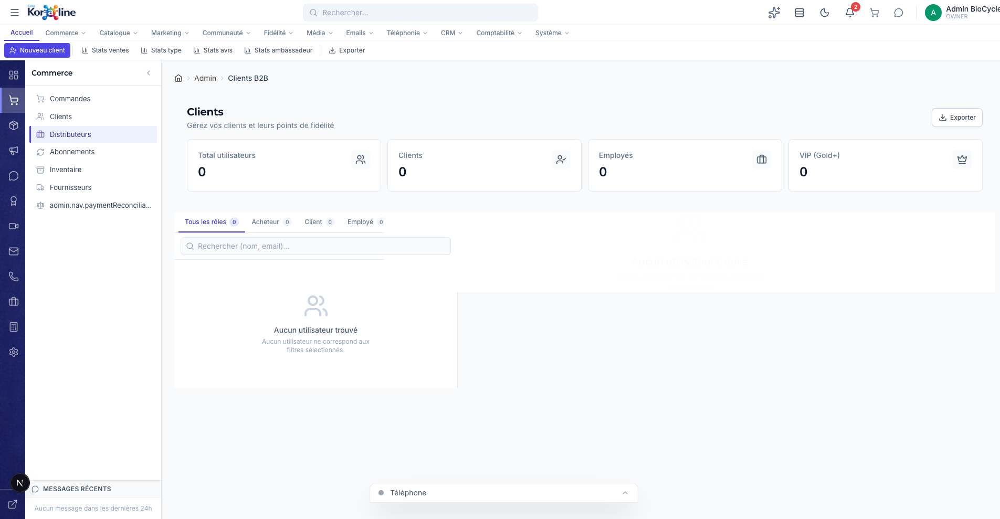

# Gestion des Distributeurs et Utilisateurs (Clients B2B)

> **Section**: Commerce > Distributeurs
> **URL**: `/admin/clients`
> **Niveau**: Debutant a avance
> **Temps de lecture**: ~20 minutes

---

## A quoi sert cette page ?

La page **Distributeurs** (aussi appelee "Clients B2B") est votre **gestionnaire d'utilisateurs complet**. Elle permet de voir et gerer TOUS les comptes de votre application, qu'ils soient acheteurs, clients B2B, employes ou proprietaires.

> **Attention nomenclature** :
> - L'URL est `/admin/clients` mais la sidebar dit "Distributeurs"
> - Le breadcrumb dit "Clients B2B"
> - Le titre de la page dit "Clients"
> - En realite, cette page gere **tous les types d'utilisateurs**

**Ce que vous pouvez faire ici** :
- Voir tous les utilisateurs de l'application avec leurs roles
- Filtrer par role (Acheteur, Client, Employe, Proprietaire)
- Consulter la fiche detaillee d'un utilisateur
- Changer le role d'un utilisateur (promouvoir un client en employe, etc.)
- Ajuster manuellement les points de fidelite
- Envoyer un email directement a un utilisateur
- Reinitialiser le mot de passe d'un utilisateur
- Suspendre un compte utilisateur
- Voir les commandes d'un utilisateur
- Exporter la liste en CSV

---

## Comment y acceder

1. Cliquez sur **Commerce** dans la barre de navigation
2. Cliquez sur **Distributeurs** dans le panneau lateral

---

## Vue d'ensemble de l'interface

### Les 4 cartes de statistiques

| Carte | Description |
|-------|-------------|
| **Total utilisateurs** | Nombre total de comptes dans le systeme |
| **Clients** | Utilisateurs avec le role CUSTOMER (acheteurs) |
| **Employes** | Utilisateurs avec le role EMPLOYEE (votre equipe) |
| **VIP (Gold+)** | Utilisateurs de niveau Gold, Platinum ou Diamond |

### Les onglets de filtrage par role

| Onglet | Qui sont-ils | Cas d'usage |
|--------|-------------|-------------|
| **Tous les roles** | Tout le monde | Vue globale |
| **Acheteur** | Clients qui ont passe commande | Gestion courante |
| **Client** | Comptes crees mais pas encore achete | Prospects, comptes B2B |
| **Employe** | Votre equipe interne | Gestion RH |
| **Proprietaire** | Administrateurs du site | Votre compte et ceux des associes |

> **Pour les neophytes** :
> - **Acheteur** = quelqu'un qui a fait au moins 1 achat
> - **Client** = quelqu'un qui a un compte mais n'a pas encore achete (ou un partenaire B2B)
> - **Employe** = un membre de votre equipe que vous avez ajoute au systeme
> - **Proprietaire** = vous (le boss) et vos administrateurs avec acces complet

---

## Fonctionnalites detaillees

### 1. Consulter la fiche d'un utilisateur

**Etapes** :
1. Cliquez sur un utilisateur dans la liste
2. Le panneau de detail s'ouvre a droite

**Informations visibles** :
- Nom, email, telephone
- Role actuel (Acheteur/Client/Employe/Proprietaire)
- Niveau de fidelite + points
- Code de parrainage (si ambassadeur)
- Historique des commandes (lien)

---

### 2. Changer le role d'un utilisateur

**Objectif** : Promouvoir ou retrograder un utilisateur.

**Cas d'usage typiques** :
- Un client regulier devient partenaire B2B → passer de "Acheteur" a "Client"
- Vous embauchez quelqu'un → passer a "Employe"
- Un employe part → retrograder a "Client"

**Etapes** :
1. Selectionnez l'utilisateur
2. Dans la section **Gestion des roles** du panneau de detail
3. Selectionnez le nouveau role
4. Confirmez

> **Important** : Changer le role d'un utilisateur affecte ses **permissions d'acces**. Un Employe a acces au panneau admin, un Acheteur non.

---

### 3. Ajuster manuellement les points de fidelite

**Objectif** : Ajouter ou retirer des points de fidelite a un utilisateur.

**Quand l'utiliser** :
- Geste commercial (offrir des points bonus)
- Correction d'erreur (points non credites suite a un bug)
- Penalite (retrait de points en cas d'abus)
- Migration (transfert de points depuis un ancien systeme)

**Etapes** :
1. Selectionnez l'utilisateur
2. Dans la section **Ajustement de points** du panneau de detail
3. Entrez le nombre de points (positif pour ajouter, negatif pour retirer)
4. Indiquez la raison
5. Confirmez

---

### 4. Envoyer un email a un utilisateur

**Objectif** : Communiquer directement avec un client depuis l'admin.

**Etapes** :
1. Selectionnez l'utilisateur
2. Cliquez sur le bouton **Envoyer email** (icone enveloppe)
3. Saisissez le sujet de l'email
4. Saisissez le contenu
5. L'email est envoye immediatement

> **Astuce** : Utilisez cette fonction pour les communications individuelles. Pour les envois en masse, utilisez la section **Marketing > Newsletter**.

---

### 5. Reinitialiser le mot de passe

**Objectif** : Envoyer un lien de reinitialisation de mot de passe au client.

**Quand l'utiliser** :
- Le client a oublie son mot de passe et n'arrive pas a utiliser la page "Mot de passe oublie"
- Vous soupconnez une compromission de compte
- Le client vous contacte par telephone et ne peut pas acceder a son email de reset

**Etapes** :
1. Selectionnez l'utilisateur
2. Cliquez sur **Reinitialiser mot de passe** (icone cle)
3. Un email de reinitialisation est automatiquement envoye au client

---

### 6. Suspendre un compte

**Objectif** : Bloquer l'acces d'un utilisateur a son compte.

**Quand l'utiliser** :
- Suspicion de fraude confirmee
- Client abusif ou harcelant
- Employe licencie (bloquer l'acces immediatement)
- Demande RGPD/CASL de desactivation de compte

**Etapes** :
1. Selectionnez l'utilisateur
2. Cliquez sur **Suspendre** (bouton rouge avec icone d'interdiction)
3. Confirmez : "Suspendre [nom du client] ?"
4. Le compte est immediatement desactive

> **Attention** : La suspension est immediate. L'utilisateur ne pourra plus se connecter. Ses commandes en cours ne sont PAS annulees automatiquement.

---

### 7. Voir les commandes d'un utilisateur

**Etapes** :
1. Selectionnez l'utilisateur
2. Cliquez sur **Voir les commandes** (icone panier)
3. Vous etes redirige vers la page Commandes, filtree sur ce client

---

### 8. Exporter en CSV

Meme principe que la page Clients (acheteurs). Colonnes : Nom, Email, Telephone, Niveau fidelite, Points, Total depense, Nombre d'achats, Code parrainage, Date inscription.

---

## Scenarios concrets

### Scenario : Ajouter un partenaire B2B

1. Cliquez sur **Nouveau client** dans le ruban
2. Remplissez les informations (nom de l'entreprise, email du contact, telephone)
3. Une fois cree, changez son role a "Client" (B2B)
4. Ajustez ses points de fidelite si necessaire (bonus de bienvenue B2B)
5. Envoyez-lui un email de bienvenue avec ses identifiants

### Scenario : Gerer un employe qui part

1. Recherchez l'employe par nom ou email
2. Cliquez sur **Suspendre** pour bloquer son acces immediatement
3. Optionnellement, changez son role de "Employe" a "Client" (au lieu de suspendre)
4. Verifiez qu'il n'a pas de taches admin en cours

---

## FAQ

**Q: Quelle est la difference entre cette page et la page Clients (acheteurs) ?**
R: La page `/admin/customers` montre uniquement les acheteurs finaux avec une analyse RFM avancee. Cette page `/admin/clients` montre TOUS les types d'utilisateurs et permet de gerer les roles, les points et les acces.

**Q: Un utilisateur suspendu peut-il etre reactive ?**
R: Oui, en modifiant son statut dans sa fiche (meme bouton, action inverse).

**Q: Les points de fidelite ajustes manuellement comptent-ils pour le changement de niveau ?**
R: Oui, les points manuels ont la meme valeur que les points gagnes par achat. Si l'ajout fait depasser un seuil de niveau, le client est promu automatiquement.

---

## Glossaire

| Terme | Definition |
|-------|-----------|
| **Role** | Le type de compte : Acheteur, Client, Employe, Proprietaire |
| **B2B** | Business-to-Business — vente entre entreprises |
| **B2C** | Business-to-Consumer — vente au grand public |
| **Suspension** | Blocage temporaire ou permanent de l'acces a un compte |
| **CASL/RGPD** | Lois de protection des donnees (Canada/Europe) |

---

## Pages liees

- [Clients (acheteurs)](/admin/customers) — Vue specifique aux acheteurs avec RFM
- [Commandes](/admin/commandes) — Commandes de ces clients
- [Programme de fidelite](/admin/fidelite) — Configuration des niveaux et points
- [Employes](/admin/employes) — Gestion des employes (section Systeme)
- [Permissions](/admin/permissions) — Gestion des droits d'acces
