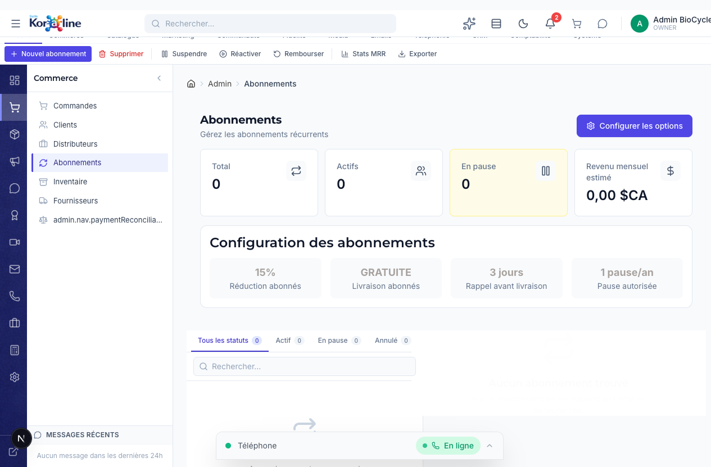

# Gestion des Abonnements

> **Section**: Commerce > Abonnements
> **URL**: `/admin/abonnements`
> **Niveau**: Debutant a avance
> **Temps de lecture**: ~25 minutes

---

## A quoi sert cette page ?

La page **Abonnements** vous permet de gerer les commandes recurrentes de vos clients. Un abonnement, c'est un client qui a choisi de recevoir automatiquement un produit a intervalle regulier (tous les 2, 4, 6 ou 12 mois) avec une reduction.

**En tant que gestionnaire, vous pouvez :**
- Voir tous les abonnements en cours, en pause ou annules
- Filtrer par statut (Actif, En pause, Annule)
- Rechercher un abonnement par nom de client, email ou produit
- Consulter le detail complet de chaque abonnement (produit, format, frequence, prix, remise)
- Suspendre temporairement un abonnement (le client garde son compte, mais pas de livraison)
- Reactiver un abonnement en pause
- Annuler definitivement un abonnement
- Modifier les parametres d'un abonnement (frequence, quantite, remise, prochaine livraison)
- Configurer les options globales (remise par defaut, livraison gratuite, rappels, pauses autorisees)
- Voir les statistiques : nombre total, actifs, en pause, revenu mensuel estime (MRR)
- Calculer le MRR et l'ARR (revenu annuel recurrent) via le bouton Stats MRR
- Exporter la liste des abonnements en CSV

---

## Concepts cles pour les debutants

### Qu'est-ce qu'un abonnement ?
Un abonnement est un engagement du client a recevoir un produit de facon reguliere. Au lieu de recommander manuellement a chaque fois, le systeme genere automatiquement une commande selon la frequence choisie.

### Les frequences disponibles
| Frequence | Description | Livraisons par an |
|-----------|-------------|-------------------|
| **Tous les 2 mois** | Frequence la plus courte | 6 livraisons |
| **Tous les 4 mois** | Frequence trimestrielle | 3 livraisons |
| **Tous les 6 mois** | Frequence semestrielle | 2 livraisons |
| **Tous les 12 mois** | Frequence annuelle | 1 livraison |

### Les statuts d'un abonnement
| Statut | Couleur | Signification |
|--------|---------|---------------|
| **Actif** | Vert | L'abonnement fonctionne normalement, les livraisons sont planifiees |
| **En pause** | Jaune/Orange | L'abonnement est temporairement suspendu (pas de livraison prevue) |
| **Annule** | Rouge | L'abonnement est definitivement arrete (irreversible) |

### Qu'est-ce que le MRR ?
Le **MRR** (Monthly Recurring Revenue / Revenu Mensuel Recurrent) est le montant total que vous recevez chaque mois grace aux abonnements actifs. C'est un indicateur cle pour mesurer la sante financiere de votre business recurrent.

**Exemple** : Un client abonne a un produit a 100$ tous les 2 mois genere un MRR de 50$/mois (100$ / 2 mois).

L'**ARR** (Annual Recurring Revenue) est simplement le MRR x 12.

---

## Comment y acceder

### Methode 1 : Via le menu principal
1. Connectez-vous a l'interface d'administration (`/admin`)
2. Dans la **barre de navigation horizontale** en haut, cliquez sur **Commerce**
3. Dans le **panneau lateral gauche** qui apparait, cliquez sur **Abonnements**

### Methode 2 : Via le rail de navigation (icones a gauche)
1. Dans la colonne d'icones tout a gauche de l'ecran, cliquez sur l'icone **panier** (Commerce)
2. Le panneau "Commerce" s'ouvre avec la liste des sous-pages
3. Cliquez sur **Abonnements** (4e element de la liste)

### Methode 3 : Via la barre de recherche
1. Cliquez sur la barre de recherche en haut au centre (ou tapez `/`)
2. Tapez "abonnements"
3. Selectionnez le resultat

---

## Vue d'ensemble de l'interface



L'interface est divisee en **5 zones principales** :

### 1. La barre de ruban (Ribbon) — en haut
C'est la barre d'outils contextuelle. Pour les abonnements, elle contient :

| Bouton | Icone | Fonction |
|--------|-------|----------|
| **Nouvel abonnement** | + vert | Informe que les abonnements se creent depuis la boutique (cote client) |
| **Supprimer** | Poubelle rouge | Annuler definitivement l'abonnement selectionne |
| **Suspendre** | Pause | Mettre en pause l'abonnement selectionne |
| **Reactiver** | Play | Reactiver un abonnement en pause |
| **Rembourser** | Fleche retour | Redirige vers Stripe pour le remboursement |
| **Stats MRR** | Graphique | Affiche un toast avec le MRR, l'ARR et le nombre d'abonnements actifs |
| **Exporter** | Telecharger | Exporter tous les abonnements au format CSV |

### 2. Les cartes de statistiques (4 cartes)
En haut de la zone principale, 4 indicateurs cles :

| Carte | Description |
|-------|-------------|
| **Total** | Nombre total d'abonnements (tous statuts confondus) |
| **Actifs** | Nombre d'abonnements actuellement actifs (fond vert) |
| **En pause** | Nombre d'abonnements temporairement suspendus (fond jaune) |
| **Revenu mensuel estime** | MRR calcule en dollars canadiens (fond indigo) |

### 3. La section Configuration
Un encadre blanc affiche les 4 parametres globaux actuels :

| Parametre | Valeur par defaut | Description |
|-----------|-------------------|-------------|
| **Reduction abonnes** | 15% | Pourcentage de remise applique a chaque livraison d'abonnement |
| **Livraison abonnes** | GRATUITE | Les abonnes beneficient de la livraison gratuite |
| **Rappel avant livraison** | 3 jours | Le client recoit un rappel X jours avant sa prochaine livraison |
| **Pause autorisee** | 1 pause/an | Nombre maximum de fois qu'un client peut mettre son abonnement en pause par annee |

### 4. Les onglets de filtre + recherche
Sous la configuration, une barre avec :
- **Onglets** : Tous les statuts | Actif | En pause | Annule (avec compteurs)
- **Barre de recherche** : Filtrer par nom, email ou produit

### 5. La liste maitre/detail (Outlook style)
L'interface est divisee en deux panneaux :
- **Panneau gauche** : Liste des abonnements filtres
- **Panneau droit** : Detail de l'abonnement selectionne

---

## Fonctions detaillees

### 1. Consulter un abonnement

1. Cliquez sur un abonnement dans la liste de gauche
2. Le panneau de droite affiche toutes les informations :
   - **Statut** : Badge colore (Actif / En pause / Annule)
   - **Client** : Nom complet et adresse email
   - **Produit** : Nom du produit et format (ex: "BPC-157 - 5mg x2")
   - **Frequence** : Tous les 2/4/6/12 mois
   - **Prix** : Montant apres remise, avec indication du pourcentage de reduction
   - **Date de creation** : Quand l'abonnement a ete souscrit
   - **Prochaine livraison** : Date prevue pour la prochaine expedition (ou "-" si en pause/annule)

### 2. Suspendre un abonnement

Suspendre = mettre en pause temporairement. Le client ne sera pas facture et ne recevra pas de livraison pendant la pause.

**Depuis le panneau de detail :**
1. Selectionnez un abonnement **Actif**
2. Cliquez sur le bouton **Pause** dans le panneau de detail (en haut a droite)
3. Le statut passe a "En pause" (badge jaune)

**Depuis le ruban :**
1. Selectionnez un abonnement **Actif** dans la liste
2. Cliquez sur **Suspendre** dans la barre de ruban en haut
3. Le statut change immediatement

> **Attention** : Chaque client a un nombre limite de pauses par annee (configurable, 1 par defaut). Au-dela, il devra annuler ou maintenir son abonnement.

### 3. Reactiver un abonnement

1. Selectionnez un abonnement **En pause**
2. Cliquez sur **Reprendre** dans le panneau de detail, OU **Reactiver** dans le ruban
3. Le statut repasse a "Actif"

> **Note** : Un abonnement **Annule** ne peut PAS etre reactive. L'annulation est definitive. Le client devra souscrire un nouvel abonnement depuis la boutique.

### 4. Annuler un abonnement

L'annulation est **irreversible**. Utilisez cette action uniquement quand vous etes certain.

1. Selectionnez l'abonnement a annuler
2. Cliquez sur **Annuler** (panneau de detail, bouton rouge) OU **Supprimer** (ruban)
3. Une **boite de confirmation** apparait : "Etes-vous sur de vouloir annuler cet abonnement ?"
4. Confirmez l'annulation
5. Le statut passe a "Annule" (badge rouge)

### 5. Modifier un abonnement

Vous pouvez ajuster les parametres d'un abonnement individuel sans l'annuler.

1. Selectionnez un abonnement dans la liste
2. Cliquez sur le bouton **Modifier** (icone crayon) dans le panneau de detail
3. Une fenetre modale s'ouvre avec 4 champs editables :

| Champ | Description | Plage |
|-------|-------------|-------|
| **Frequence** | Changer l'intervalle de livraison | Tous les 2/4/6/12 mois |
| **Quantite** | Ajuster le nombre d'unites par livraison | 1 a 99 |
| **Remise** | Modifier le pourcentage de reduction | 0% a 100% |
| **Prochaine livraison** | Reporter ou avancer la date de la prochaine livraison | Calendrier |

4. Modifiez les champs souhaites
5. Cliquez sur **Enregistrer**
6. Les modifications sont appliquees immediatement

### 6. Configurer les options globales

Ces parametres s'appliquent a TOUS les abonnements.

1. Cliquez sur le bouton **Configurer les options** (en haut a droite, bouton bleu)
2. Une fenetre modale s'ouvre avec 4 parametres :

| Parametre | Description | Defaut |
|-----------|-------------|--------|
| **Reduction par defaut** | Pourcentage de remise pour les nouveaux abonnements | 15% |
| **Livraison gratuite** | Activer/desactiver la livraison gratuite pour les abonnes (interrupteur) | Active |
| **Jours de rappel** | Nombre de jours avant la livraison pour envoyer un rappel au client | 3 |
| **Pauses max par annee** | Nombre de fois qu'un client peut suspendre son abonnement en 12 mois | 1 |

3. Ajustez les valeurs
4. Cliquez sur **Enregistrer**
5. Un message de confirmation apparait

> **Important** : Modifier la reduction par defaut n'affecte PAS les abonnements existants. Seuls les nouveaux abonnements utiliseront le nouveau pourcentage. Pour modifier un abonnement existant, utilisez la fonction "Modifier" individuelle.

### 7. Voir les statistiques MRR/ARR

1. Cliquez sur **Stats MRR** dans la barre de ruban
2. Un toast apparait avec :
   - **MRR** : Revenu mensuel recurrent (somme des prix mensuels de tous les abonnements actifs)
   - **ARR** : Revenu annuel recurrent (MRR x 12)
   - **Nombre d'abonnements actifs**

**Comment le MRR est-il calcule ?**
Pour chaque abonnement actif :
- Prix apres remise = Prix x (1 - Remise/100)
- Contribution mensuelle = Prix apres remise / nombre de mois entre livraisons
- MRR total = somme de toutes les contributions mensuelles

### 8. Exporter les abonnements

1. Cliquez sur **Exporter** dans la barre de ruban
2. Un fichier CSV est telecharge automatiquement
3. Le fichier contient : Client, Email, Produit, Format, Quantite, Frequence, Prix, Remise, Statut, Prochaine livraison, Date de creation
4. Le fichier est encode en UTF-8 avec BOM (compatible Excel)

> **Note** : L'export inclut TOUS les abonnements, pas seulement ceux filtres a l'ecran.

---

## Workflows complets

### Scenario 1 : Un client veut mettre en pause son abonnement

**Contexte** : Le client part en voyage et ne sera pas la pour recevoir sa livraison.

1. Le client vous contacte (email, chat, telephone)
2. Allez dans **Commerce > Abonnements**
3. Recherchez le client par nom ou email
4. Selectionnez son abonnement
5. Verifiez qu'il n'a pas deja utilise sa pause annuelle
6. Cliquez sur **Pause** dans le panneau de detail
7. Confirmez au client que son abonnement est suspendu
8. Quand le client revient : selectionnez l'abonnement et cliquez sur **Reprendre**

### Scenario 2 : Un client veut changer la frequence de son abonnement

**Contexte** : Le client consomme son produit plus vite que prevu et veut recevoir plus souvent.

1. Allez dans **Commerce > Abonnements**
2. Trouvez et selectionnez l'abonnement du client
3. Cliquez sur **Modifier** (icone crayon)
4. Changez la frequence (ex: de "Tous les 4 mois" a "Tous les 2 mois")
5. Optionnel : ajustez la date de prochaine livraison si necessaire
6. Cliquez sur **Enregistrer**
7. Confirmez au client

### Scenario 3 : Rapport mensuel des abonnements

**Contexte** : Vous voulez savoir combien rapportent vos abonnements chaque mois.

1. Allez dans **Commerce > Abonnements**
2. Regardez la carte **Revenu mensuel estime** en haut
3. Pour plus de details, cliquez sur **Stats MRR** dans le ruban
4. Pour un rapport complet, cliquez sur **Exporter** et ouvrez le CSV dans Excel
5. Dans Excel, filtrez par statut "ACTIVE" et calculez les totaux par produit

### Scenario 4 : Un client veut annuler son abonnement

**Contexte** : Le client ne souhaite plus recevoir le produit.

1. Allez dans **Commerce > Abonnements**
2. Trouvez et selectionnez l'abonnement du client
3. **Avant d'annuler**, considerez : proposer une pause temporaire ou un changement de frequence
4. Si le client confirme l'annulation : cliquez sur **Annuler** (bouton rouge)
5. Confirmez dans la boite de dialogue
6. L'abonnement passe au statut "Annule" — c'est irreversible

---

## FAQ — Questions frequentes

### Q : Les clients creent-ils leurs abonnements eux-memes ?
**R** : Oui. Les abonnements sont crees par les clients lors de leur achat sur la boutique en ligne. La page admin ne permet pas de creer un abonnement manuellement (le bouton "Nouvel abonnement" affiche un message informatif).

### Q : Si je change la reduction par defaut de 15% a 20%, les abonnements existants sont-ils affectes ?
**R** : Non. La modification ne s'applique qu'aux nouveaux abonnements. Pour modifier un abonnement existant, utilisez le bouton "Modifier" sur l'abonnement individuel.

### Q : Un client peut-il reactiver lui-meme un abonnement annule ?
**R** : Non. L'annulation est definitive. Le client devra creer un nouvel abonnement depuis la boutique.

### Q : Comment fonctionne le remboursement ?
**R** : Le bouton "Rembourser" dans le ruban vous redirige vers le dashboard Stripe pour effectuer le remboursement. Les remboursements ne sont pas geres directement dans l'interface Koraline.

### Q : Que se passe-t-il quand la prochaine livraison arrive ?
**R** : Le systeme genere automatiquement une commande, debite le client, et l'ajoute a la file d'expedition. Vous la verrez apparaitre dans **Commerce > Commandes** comme une commande normale.

### Q : Combien de pauses un client peut-il prendre ?
**R** : Par defaut, 1 pause par annee. Ce nombre est configurable dans **Configurer les options**. Si un client a deja utilise toutes ses pauses, il devra choisir entre maintenir ou annuler son abonnement.

---

## Strategie expert : Pricing des abonnements et optimisation du MRR

### Remise optimale pour les abonnements

La remise est le levier principal pour convaincre un client de souscrire un abonnement plutot que de commander ponctuellement. Mais une remise trop elevee erode la marge.

**Benchmarks du secteur supplements/peptides** :

| Remise | Impact sur la conversion | Impact sur la marge | Recommandation |
|--------|------------------------|--------------------|--------------------|
| 5% | Faible : insuffisant pour motiver | Negligeable | Trop faible, ne pas utiliser |
| 10% | Moyen : attire les clients sensibles au prix | Acceptable | Minimum recommande |
| 15% | Fort : bon equilibre conversion/marge | Modere | Ideal pour BioCycle (defaut actuel) |
| 20% | Tres fort : maximise les inscriptions | Significatif | A reserver aux periodes promotionnelles |
| 25%+ | Maximum : diminishing returns | Critique | A eviter sauf offre de lancement temporaire |

**Recommandation BioCycle** : maintenir la remise par defaut a 15%. Utiliser 20% pour des campagnes d'acquisition limitees dans le temps (ex: "Abonnez-vous en janvier, profitez de 20% les 3 premiers mois").

### Offres de lancement recommandees

| Strategie | Description | Duree |
|-----------|-------------|-------|
| Premiere livraison -25%, puis -15% | Forte incitation initiale, puis marge standard | Permanent |
| 3 mois a -20%, puis -15% | Engagement initial plus doux | Campagne trimestrielle |
| Livraison gratuite permanente | Inclus dans l'abonnement (deja actif par defaut) | Permanent |
| Cadeau a la 3e livraison | Eau bacteriostatique gratuite a la 3e livraison | Permanent |

---

## Strategie expert : Gestion du churn et tactiques anti-churn

### Taux de churn : reperes par industrie

Le **churn** (taux d'attrition) est le pourcentage d'abonnes qui annulent chaque mois.

| Industrie | Churn mensuel moyen | Churn acceptable |
|-----------|--------------------|--------------------|
| SaaS B2B | 3-5% | Moins de 3% |
| Supplements alimentaires | 8-12% | Moins de 8% |
| Peptides de recherche | 5-8% (estime) | Moins de 5% |
| Box mensuelles | 10-15% | Moins de 10% |

**Cible BioCycle** : maintenir le churn mensuel en dessous de 5%. Avec 100 abonnes, cela signifie perdre moins de 5 abonnes par mois.

### Calcul de l'impact du churn sur le MRR

```
Perte mensuelle MRR = MRR actuel x Taux de churn
Mois pour perdre 50% des abonnes = ln(0.5) / ln(1 - taux_churn)
```

**Exemple concret** :
- MRR actuel : 5 000 $CA (100 abonnes a 50 $CA/mois en moyenne)
- Churn 5%/mois : perte de 250 $CA/mois ; il faut 13,5 mois pour perdre la moitie des abonnes
- Churn 10%/mois : perte de 500 $CA/mois ; il faut 6,6 mois pour perdre la moitie

La difference entre 5% et 10% de churn represente **3 000 $CA de MRR** perdu en 12 mois.

### Tactiques anti-churn (a appliquer dans Koraline)

#### 1. Proposer la pause avant l'annulation

Quand un client clique sur "Annuler" sur la boutique, ou quand il vous contacte pour annuler :
- **Premiere proposition** : "Voulez-vous plutot mettre en pause votre abonnement ? Vous pouvez reprendre quand vous voulez."
- Augmenter le nombre de pauses autorisees de 1 a 2 par an si le taux de churn est eleve

#### 2. Proposer un changement de frequence

Si le client annule parce qu'il a "trop de stock" :
- Proposer de passer a une frequence moins elevee (de 2 mois a 4 mois, par exemple)
- La modification se fait via le bouton **Modifier** dans le panneau de detail

#### 3. Offrir un upgrade ou un downgrade

Si le client annule pour des raisons de budget :
- Proposer un format plus petit (5mg au lieu de 10mg) a prix reduit
- Ou proposer un autre peptide moins couteux

#### 4. Sondage de depart (obligatoire)

Quand un abonnement est annule, enregistrer la raison dans une note interne. Les raisons typiques :
- Trop cher (solution : offre de remise temporaire)
- Trop de stock accumule (solution : changement de frequence)
- Ne voit pas de resultats (solution : contenu educatif, support)
- Probleme de qualite (solution : investigation immediate, remplacement)
- Raison personnelle / temporaire (solution : pause)

### Suivi mensuel du churn

Creer un tableau de bord mensuel avec ces indicateurs :

| Indicateur | Formule | Cible |
|-----------|---------|-------|
| Taux de churn | Annulations du mois / Abonnes debut de mois | Moins de 5% |
| Croissance nette des abonnes | Nouveaux abonnes - Annulations | Positif chaque mois |
| Taux de reactivation des pauses | Pauses reprises / Total des pauses | Plus de 60% |
| MRR net | MRR nouveaux - MRR perdus + MRR upgrades | En croissance |

---

## Glossaire

| Terme | Definition |
|-------|-----------|
| **Abonnement** | Commande recurrente automatique pour un produit, a une frequence et un prix definis |
| **MRR** | Monthly Recurring Revenue — revenu mensuel recurrent genere par les abonnements actifs |
| **ARR** | Annual Recurring Revenue — revenu annuel recurrent (MRR x 12) |
| **Frequence** | Intervalle entre chaque livraison (2, 4, 6 ou 12 mois) |
| **Remise** | Pourcentage de reduction applique au prix normal du produit pour les abonnes |
| **Pause** | Suspension temporaire d'un abonnement sans l'annuler |
| **CSV** | Format de fichier tableur (Comma Separated Values), compatible avec Excel et Google Sheets |

---

## Pages liees

- [Commandes](01-commandes.md) — Les commandes generees par les abonnements apparaissent ici
- [Clients](02-clients.md) — Voir le profil complet des clients abonnes
- [Inventaire](05-inventaire.md) — Verifier que le stock couvre les abonnements a venir
- [Fournisseurs](06-fournisseurs.md) — Commander les produits necessaires aux abonnements
