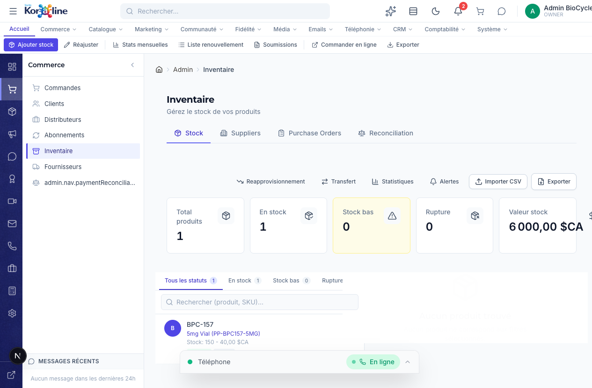

# Gestion de l'Inventaire

> **Section**: Commerce > Inventaire
> **URL**: `/admin/inventaire`
> **Niveau**: Debutant a avance
> **Temps de lecture**: ~35 minutes

---

## A quoi sert cette page ?

La page **Inventaire** est votre centre de controle pour tout ce qui concerne le stock de vos produits. Elle combine 4 fonctions majeures en une seule page a onglets.

**En tant que gestionnaire, vous pouvez :**
- Voir les niveaux de stock de tous vos produits et formats (quantite, seuil d'alerte, disponibilite)
- Ajouter du stock (reapprovisionnement)
- Ajuster les quantites (correction d'erreurs, retours, pertes)
- Configurer les alertes de stock bas pour chaque produit
- Gerer vos fournisseurs (nom, contact, email, telephone, site web)
- Creer et suivre des bons de commande (Purchase Orders) aupres de vos fournisseurs
- Reconcilier votre stock informatique avec votre stock physique
- Voir les statistiques mensuelles d'inventaire
- Importer des donnees de stock depuis un fichier CSV
- Exporter l'inventaire complet au format CSV

---

## Concepts cles pour les debutants

### Qu'est-ce que le stock ?
Le stock, c'est la quantite physique de chaque produit que vous avez en entrepot, prete a etre expediee aux clients. Quand un client achete, le stock diminue. Quand vous recevez une livraison de votre fournisseur, le stock augmente.

### Les niveaux de stock
| Indicateur | Couleur | Signification |
|------------|---------|---------------|
| **En stock** | Vert | Quantite suffisante, au-dessus du seuil d'alerte |
| **Stock bas** | Jaune/Orange | Quantite en dessous du seuil d'alerte — il faut commander bientot |
| **Rupture** | Rouge | Stock a 0 — le produit n'est plus disponible a la vente |

### Le seuil d'alerte (Low Stock Threshold)
C'est la quantite minimale que vous definissez pour chaque produit. Quand le stock descend en dessous de ce seuil, le systeme vous alerte. Par exemple, si le seuil est 10, vous serez alerte quand il reste 9 unites ou moins.

### Qu'est-ce qu'un bon de commande (Purchase Order / PO) ?
C'est un document qui formalise votre demande d'achat aupres d'un fournisseur. Il liste les produits, quantites, prix unitaires et la date de livraison prevue. Les statuts d'un PO sont : Brouillon, Commande, Partiel, Recu, Annule.

### Qu'est-ce que la reconciliation ?
La reconciliation consiste a comparer le stock enregistre dans le systeme avec le stock physique reel dans votre entrepot. Si les chiffres ne correspondent pas (ecarts), vous pouvez ajuster le stock et documenter la raison.

---

## Comment y acceder

### Methode 1 : Via le menu principal
1. Connectez-vous a l'interface d'administration (`/admin`)
2. Dans la **barre de navigation horizontale** en haut, cliquez sur **Commerce**
3. Dans le **panneau lateral gauche**, cliquez sur **Inventaire**

### Methode 2 : Via le rail de navigation
1. Cliquez sur l'icone **panier** (Commerce) dans la colonne d'icones a gauche
2. Cliquez sur **Inventaire** (5e element de la liste)

### Methode 3 : Via la barre de recherche
1. Tapez "inventaire" dans la barre de recherche en haut
2. Selectionnez le resultat

---

## Vue d'ensemble de l'interface



L'interface est organisee en **4 onglets** en haut de la zone principale :

| Onglet | Icone | Description |
|--------|-------|-------------|
| **Stock** | Paquet | Vue principale — niveaux de stock de tous les produits |
| **Suppliers** | Batiment | Gestion des fournisseurs |
| **Purchase Orders** | Presse-papiers | Bons de commande fournisseurs |
| **Reconciliation** | Balance | Verification stock informatique vs stock physique |

### La barre de ruban (Ribbon)
Les boutons du ruban changent selon l'onglet actif :

| Bouton | Fonction |
|--------|----------|
| **Ajouter stock** | Ouvrir le formulaire de reapprovisionnement |
| **Reajuster** | Ouvrir le formulaire d'ajustement de stock |
| **Stats mensuelles** | Afficher les statistiques de mouvements de stock |
| **Liste renouvellement** | Voir les produits qui doivent etre commandes |
| **Soumissions** | Acceder aux soumissions fournisseurs |
| **Commander en ligne** | Commander directement aupres d'un fournisseur |
| **Exporter** | Telecharger l'inventaire au format CSV |

---

## Onglet 1 : Stock

### Les cartes de statistiques (5 cartes)

| Carte | Description |
|-------|-------------|
| **Total produits** | Nombre de references (formats de produits) dans le systeme |
| **En stock** | Nombre de produits avec stock > 0 |
| **Stock bas** | Nombre de produits en dessous de leur seuil d'alerte (fond jaune) |
| **Rupture** | Nombre de produits a stock 0 |
| **Valeur stock** | Valeur totale du stock en dollars canadiens (prix de vente x quantite) |

### Les sous-onglets de filtre
Sous les cartes, une barre de filtres :
- **Tous les statuts** — Afficher tous les produits
- **En stock** — Uniquement les produits disponibles
- **Stock bas** — Uniquement les produits sous le seuil d'alerte
- **Rupture** — Uniquement les produits en rupture

### La barre de recherche
Tapez un nom de produit ou un SKU pour filtrer la liste.

### La liste maitre/detail
- **Panneau gauche** : Liste des produits avec stock, SKU et prix
- **Panneau droit** : Detail du produit selectionne

### Actions sur un produit

#### Ajouter du stock (Reapprovisionnement)
1. Selectionnez un produit dans la liste
2. Cliquez sur **Reappro** dans les actions rapides du panneau de detail
3. Entrez la quantite a ajouter
4. Optionnel : ajoutez une note (ex: "Reception fournisseur 2026-03-20")
5. Confirmez — le stock est augmente immediatement

#### Ajuster le stock
1. Selectionnez un produit
2. Cliquez sur **Ajustement** dans les actions rapides
3. Entrez la nouvelle quantite corrigee
4. Donnez obligatoirement une **raison** (ex: "Inventaire physique - 3 unites cassees")
5. Confirmez

#### Modifier le seuil d'alerte
1. Selectionnez un produit
2. Dans le panneau de detail, cliquez sur l'icone **Modifier** (crayon) a cote du seuil
3. Entrez le nouveau seuil
4. Enregistrez

#### Voir l'historique des mouvements
1. Selectionnez un produit
2. Dans le panneau de detail, cliquez sur **Historique**
3. Une liste chronologique affiche tous les mouvements : ajouts, ventes, ajustements, avec dates et raisons

#### Configurer les alertes
1. Cliquez sur le bouton **Alertes** dans les actions rapides
2. Verifiez les seuils de chaque produit
3. Ajustez si necessaire

---

## Onglet 2 : Suppliers (Fournisseurs)

### Voir la liste des fournisseurs
Un tableau affiche tous vos fournisseurs avec :
- **Nom** — Nom de l'entreprise fournisseur
- **Contact** — Nom de la personne-contact
- **Email** — Lien cliquable pour envoyer un email
- **Telephone** — Numero de contact
- **Site web** — Lien vers le site du fournisseur

### Ajouter un fournisseur
1. Cliquez sur **Add Supplier** en haut a droite
2. Un formulaire apparait avec les champs :
   - **Nom** (obligatoire)
   - Contact, Email, Telephone, Adresse, Site web, Notes (optionnels)
3. Cliquez sur **Create Supplier**

---

## Onglet 3 : Purchase Orders (Bons de commande)

### Voir les bons de commande
Un tableau liste tous les PO avec :
- **ID** — Identifiant unique du bon
- **Fournisseur** — Nom du fournisseur
- **Articles** — Nombre de lignes
- **Total** — Montant total du bon
- **Statut** — Badge colore (DRAFT, ORDERED, PARTIAL, RECEIVED, CANCELLED)
- **Date prevue** — Date de livraison esperee
- **Date de creation**

### Filtrer par statut
Des boutons en haut permettent de filtrer : Tous, DRAFT, ORDERED, PARTIAL, RECEIVED, CANCELLED.

### Creer un bon de commande
1. Cliquez sur **New Purchase Order**
2. Selectionnez un **fournisseur** (obligatoire)
3. Entrez la **date de livraison prevue** (optionnel)
4. Ajoutez les **lignes d'articles** :
   - Product ID (obligatoire)
   - Format ID (optionnel)
   - Quantite (minimum 1)
   - Cout unitaire (doit etre > 0)
5. Cliquez sur **+ Add Item** pour ajouter d'autres lignes
6. Le total se calcule automatiquement
7. Cliquez sur **Create PO**

### Statuts d'un bon de commande
| Statut | Signification |
|--------|---------------|
| **DRAFT** | Brouillon — pas encore envoye au fournisseur |
| **ORDERED** | Commande passee au fournisseur |
| **PARTIAL** | Livraison partielle recue |
| **RECEIVED** | Totalement recu — le stock peut etre mis a jour |
| **CANCELLED** | Annule |

---

## Onglet 4 : Reconciliation

### Qu'est-ce qu'on voit ?
Un tableau compare, pour chaque produit/format :
- **Stock enregistre** — ce que dit le systeme
- **Stock calcule** — base sur les ventes et receptions
- **Ecart** — la difference entre les deux
- **Statut** — MATCH (aucun ecart) ou DISCREPANCY (ecart detecte)

### Filtrer les ecarts
Deux boutons : **Tous** et **Ecarts seulement** pour ne voir que les produits avec des differences.

### Corriger un ecart
1. Identifiez un produit avec le statut **DISCREPANCY**
2. Cliquez sur **Ajuster** a cote de ce produit
3. Entrez la quantite reelle (stock physique)
4. Donnez une **raison obligatoire** (ex: "Comptage physique 20 mars", "Produit endommage", "Erreur de saisie")
5. Confirmez — le stock est corrige et l'evenement est enregistre

---

## Workflows complets

### Scenario 1 : Reception d'une livraison fournisseur

1. Le colis arrive a l'entrepot
2. Verifiez le contenu physique par rapport au bon de commande
3. Allez dans **Inventaire > Purchase Orders**
4. Trouvez le PO correspondant
5. Si tout est recu : passez le statut a RECEIVED
6. Allez dans l'onglet **Stock**
7. Pour chaque produit recu, cliquez sur **Reappro** et ajoutez la quantite
8. Verifiez que les cartes de statistiques se mettent a jour

### Scenario 2 : Inventaire physique mensuel

1. Imprimez la liste de stock (bouton Exporter > ouvrir le CSV)
2. Faites le comptage physique dans l'entrepot
3. Allez dans **Inventaire > Reconciliation**
4. Comparez les chiffres systeme vs physique
5. Pour chaque ecart, cliquez sur **Ajuster** avec la quantite reelle et la raison
6. Exportez le rapport apres reconciliation pour vos archives

### Scenario 3 : Stock bas detecte

1. Vous voyez un badge jaune sur la carte **Stock bas** (ou recevez une alerte)
2. Cliquez sur l'onglet de filtre **Stock bas**
3. Identifiez les produits concernes
4. Allez dans **Suppliers** — identifiez le fournisseur
5. Allez dans **Purchase Orders** > **New Purchase Order**
6. Selectionnez le fournisseur, ajoutez les produits et quantites
7. Creez le PO et envoyez-le au fournisseur

---

## FAQ — Questions frequentes

### Q : Quelle est la difference entre "Ajouter stock" et "Ajuster" ?
**R** : "Ajouter stock" ajoute une quantite a la quantite existante (ex: stock 50 + ajout 20 = 70). "Ajuster" remplace la quantite par la nouvelle valeur (ex: stock 50, ajustement a 47 = 47). L'ajustement exige une raison.

### Q : Le stock se met-il a jour automatiquement quand un client achete ?
**R** : Oui. Chaque commande confirmee diminue automatiquement le stock du produit et format correspondant.

### Q : Peut-on avoir des alertes automatiques quand le stock est bas ?
**R** : Oui. Definissez un seuil d'alerte (lowStockThreshold) pour chaque produit. Quand le stock descend en dessous, la carte "Stock bas" se met a jour et des notifications sont envoyees.

### Q : Comment exporter le stock pour ma comptabilite ?
**R** : Cliquez sur **Exporter** dans le ruban. Un fichier CSV avec tous les produits, quantites, prix et valeur est telecharge. Ouvrez-le dans Excel.

### Q : Les bons de commande mettent-ils a jour le stock automatiquement ?
**R** : Non. Quand un PO passe a RECEIVED, vous devez manuellement ajouter le stock via "Ajouter stock" dans l'onglet Stock. C'est un controle volontaire pour verifier la reception physique.

---

## Strategie expert : Gestion specifique des peptides

### Conditions de stockage des peptides lyophilises

Les peptides synthetiques sont des produits sensibles qui necessitent des conditions de stockage rigoureuses pour maintenir leur purete et leur efficacite.

| Condition | Specification | Consequence si non respecte |
|-----------|--------------|----------------------------|
| **Temperature** | 2 a 8 degres Celsius (refrigere) pour le long terme ; temperature ambiante (moins de 25 degres) pour le court terme (moins de 30 jours) | Degradation acceleree, perte de purete, produit inutilisable |
| **Humidite** | Moins de 40% d'humidite relative ; stockage dans un contenant etanche avec dessiccant | Reconstitution prematuree, contamination, agglutination |
| **Lumiere** | A l'abri de la lumiere directe ; stockage dans des contenants opaques ou ambre | Photo-degradation, perte d'activite biologique |
| **Vibrations** | Eviter les manipulations excessives | Fragmentation des composes lyophilises |

### Duree de conservation

| Type de peptide | Duree conservation (lyophilise, scelle) | Duree conservation (reconstitue) |
|----------------|---------------------------------------|----------------------------------|
| Peptides standards (BPC-157, TB-500) | 24 mois a compter de la fabrication | 30 jours refrigere |
| Peptides complexes (CJC-1295 DAC) | 18-24 mois | 14-21 jours refrigere |
| Melanotane / PT-141 | 24 mois | 30 jours refrigere |

### Chaine de froid

Pour les expeditions, maintenir la chaine de froid en ete ou pour les envois longue distance :
1. Utiliser des pochettes isothermes avec gel refrigerant pour les envois de plus de 48 heures en transit
2. Expedier en debut de semaine (lundi-mercredi) pour eviter que les colis ne restent en entrepot de tri le week-end
3. Eviter les expeditions les vendredis avant jours feries prolonges

---

## Strategie expert : Calcul du point de reorder optimal

### Formule du point de reorder

Le point de reorder (ou seuil de reapprovisionnement) est la quantite de stock a laquelle il faut passer une commande fournisseur pour eviter la rupture.

```
Point de reorder = (Consommation moyenne quotidienne x Delai d'approvisionnement en jours) + Stock de securite
```

### Calcul du stock de securite

Le stock de securite absorbe les variations de demande et les retards fournisseurs.

```
Stock de securite = Facteur de securite x Ecart-type de la demande quotidienne x Racine carree du delai d'approvisionnement
```

**Facteurs de securite courants** :
| Niveau de service cible | Facteur de securite |
|------------------------|---------------------|
| 90% (acceptable) | 1,28 |
| 95% (recommande) | 1,65 |
| 99% (critique) | 2,33 |

### Exemple concret pour BioCycle Peptides

Prenons le BPC-157 5mg :
- **Consommation moyenne** : 8 unites par jour (environ 240 par mois)
- **Delai d'approvisionnement** : 21 jours (3 semaines pour un fournisseur chinois avec livraison maritime)
- **Ecart-type de la demande** : 3 unites par jour
- **Facteur de securite** : 1,65 (service 95%)

```
Stock de securite = 1,65 x 3 x racine(21) = 1,65 x 3 x 4,58 = 22,7 ≈ 23 unites
Point de reorder = (8 x 21) + 23 = 168 + 23 = 191 unites
```

Il faut donc configurer le seuil d'alerte a **191 unites** dans Koraline pour ce produit. Quand le stock descend en dessous de 191, lancer immediatement un bon de commande fournisseur.

### Recommandations par produit

| Categorie | Delai approvisionnement typique | Stock securite recommande |
|-----------|-------------------------------|--------------------------|
| Peptides populaires (BPC-157, TB-500) | 14-21 jours | 3-4 semaines de stock |
| Peptides specialises (CJC-1295, Ipamorelin) | 21-30 jours | 4-6 semaines de stock |
| Accessoires (seringues, eau bacteriostatique) | 7-14 jours | 2-3 semaines de stock |
| Supplements | 14-21 jours | 3-4 semaines de stock |

---

## Strategie expert : Methode FIFO obligatoire pour les produits perissables

### Qu'est-ce que FIFO ?

FIFO signifie "First In, First Out" (premier entre, premier sorti). Cela signifie que les produits recus en premier doivent etre vendus en premier.

### Pourquoi FIFO est obligatoire pour les peptides

1. **Duree de conservation limitee** : les peptides lyophilises ont une duree de vie de 18-24 mois. Sans FIFO, les lots anciens risquent d'expirer en entrepot.
2. **Tracabilite des lots** : en cas de probleme qualite, il faut pouvoir identifier rapidement quels clients ont recu un lot specifique.
3. **Conformite reglementaire** : les bonnes pratiques de distribution (BPD) exigent le suivi des lots et la rotation des stocks.

### Mise en oeuvre pratique dans l'entrepot

1. **Etiquetage** : chaque lot recu porte une etiquette avec le numero de lot, la date de reception et la date d'expiration
2. **Organisation physique** : les nouveaux lots sont places derriere les lots existants sur les etageres
3. **Verification picking** : lors de la preparation des commandes, toujours prelever les lots avec la date d'expiration la plus proche
4. **Alerte d'expiration** : configurer une alerte a 90 jours avant la date d'expiration pour les lots restants

### Suivi dans Koraline

A chaque reapprovisionnement dans l'onglet **Stock**, ajouter une note avec :
- Le numero de lot du fournisseur
- La date de fabrication
- La date d'expiration
- La quantite recue

Cela permet de reconstituer l'historique complet lors d'une reconciliation ou d'un rappel de lot.

---

## Glossaire

| Terme | Definition |
|-------|-----------|
| **SKU** | Stock Keeping Unit — code unique identifiant un produit/format specifique (ex: PP-BPC157-5MG) |
| **Seuil d'alerte** | Quantite minimale en dessous de laquelle le produit est considere en "stock bas" |
| **Rupture de stock** | Stock = 0, le produit n'est plus vendable |
| **PO** | Purchase Order — bon de commande aupres d'un fournisseur |
| **Reconciliation** | Processus de comparaison entre le stock informatique et le stock physique |
| **MRR** | Voir glossaire de la page [Abonnements](04-abonnements.md) |
| **CSV** | Format de fichier tableur compatible Excel/Google Sheets |
| **Reappro** | Reapprovisionnement — ajouter du stock suite a une reception |

---

## Pages liees

- [Commandes](01-commandes.md) — Les ventes qui diminuent le stock
- [Abonnements](04-abonnements.md) — Les livraisons recurrentes qui utilisent le stock
- [Fournisseurs](06-fournisseurs.md) — Page dediee a la gestion complete des fournisseurs
- [Paiements](07-paiements.md) — Reconciliation financiere des achats fournisseurs
