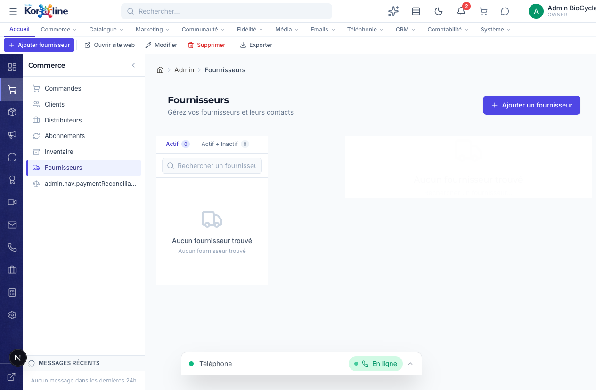

# Gestion des Fournisseurs

> **Section**: Commerce > Fournisseurs
> **URL**: `/admin/fournisseurs`
> **Niveau**: Debutant a intermediaire
> **Temps de lecture**: ~20 minutes

---

## A quoi sert cette page ?

La page **Fournisseurs** est votre carnet d'adresses professionnel pour toutes les entreprises qui vous fournissent des produits. C'est ici que vous centralisez toutes les informations de contact, les liens utiles (portails de commande, catalogues, suivi) et les personnes-contact par departement.

**En tant que gestionnaire, vous pouvez :**
- Voir la liste de tous vos fournisseurs (actifs et inactifs)
- Ajouter un nouveau fournisseur avec ses coordonnees completes
- Ajouter plusieurs contacts par fournisseur (ventes, comptabilite, support, logistique)
- Ajouter des liens utiles (portail de commande, chat, catalogue, suivi de colis)
- Modifier ou supprimer un fournisseur
- Ouvrir directement le site web d'un fournisseur
- Exporter la liste au format CSV
- Marquer un fournisseur comme actif ou inactif

---

## Concepts cles pour les debutants

### Qu'est-ce qu'un fournisseur ?
Un fournisseur est une entreprise qui vous vend les produits que vous revendez a vos clients. Par exemple, le laboratoire qui fabrique vos peptides est un fournisseur.

### Contacts multiples
Chaque fournisseur peut avoir plusieurs personnes-contact, chacune dans un departement different :
- **Ventes** — pour passer les commandes
- **Comptabilite** — pour les factures et paiements
- **Support** — pour les problemes techniques
- **Logistique** — pour le suivi des livraisons

Un contact peut etre marque comme **principal** (etoile) pour indiquer qui contacter en premier.

### Liens utiles
Chaque fournisseur peut avoir des liens vers :
| Type | Description |
|------|-------------|
| **Portail de commande** | Page web pour passer des commandes en ligne |
| **Chat** | Messagerie instantanee du fournisseur |
| **Portail** | Espace client du fournisseur |
| **Catalogue** | PDF ou page web du catalogue produits |
| **Suivi** | Page de tracking des colis |
| **Autre** | Tout autre lien utile |

---

## Comment y acceder

1. Dans la **barre de navigation horizontale**, cliquez sur **Commerce**
2. Dans le **panneau lateral**, cliquez sur **Fournisseurs** (6e element)

---

## Vue d'ensemble de l'interface

### La barre de ruban (Ribbon)

| Bouton | Fonction |
|--------|----------|
| **Ajouter fournisseur** | Ouvrir le formulaire de creation |
| **Ouvrir site web** | Ouvrir le site web du fournisseur selectionne dans un nouvel onglet |
| **Modifier** | Editer les informations du fournisseur selectionne |
| **Supprimer** | Supprimer definitivement le fournisseur selectionne |
| **Exporter** | Telecharger la liste des fournisseurs en CSV |

### La liste maitre/detail
- **Panneau gauche** : Liste des fournisseurs avec badges (Actif/Inactif), nombre de contacts
- **Panneau droit** : Detail complet du fournisseur selectionne

### Onglets de filtre
- **Actif** — Seulement les fournisseurs actifs
- **Actif + Inactif** — Tous les fournisseurs

---

## Fonctions detaillees

### 1. Ajouter un fournisseur

1. Cliquez sur **Ajouter un fournisseur** (bouton vert dans le ruban, ou bouton bleu en haut a droite)
2. Un formulaire complet s'ouvre avec les sections :

**Informations generales :**
| Champ | Obligatoire | Description |
|-------|-------------|-------------|
| Nom | Oui | Nom de l'entreprise fournisseur |
| Code | Non | Code interne (ex: FURN-001) |
| Email | Non | Email general du fournisseur |
| Telephone | Non | Numero principal |
| Site web | Non | URL du site internet |
| Adresse | Non | Adresse postale complete |
| Ville | Non | Ville |
| Province | Non | Province/Etat |
| Code postal | Non | Code postal |
| Pays | Non | Pays |
| Notes | Non | Notes internes (invisible pour le fournisseur) |
| Actif | Oui | Interrupteur actif/inactif (defaut: actif) |

**Contacts :**
- Cliquez sur **Ajouter un contact** pour chaque personne-contact
- Champs : Nom, Departement (Ventes/Comptabilite/Support/Logistique), Email, Telephone, Poste, Titre, Principal (oui/non)

**Liens :**
- Cliquez sur **Ajouter un lien** pour chaque lien utile
- Champs : Libelle, URL, Type (Portail de commande/Chat/Portail/Catalogue/Suivi/Autre)

3. Cliquez sur **Enregistrer**

### 2. Consulter un fournisseur

1. Cliquez sur un fournisseur dans la liste de gauche
2. Le panneau de detail affiche :
   - **Nom et code** en en-tete
   - **Badge** Actif (vert) ou Inactif (gris)
   - **Coordonnees** : email (cliquable), telephone, adresse complete, site web (lien)
   - **Contacts** : liste des personnes-contact avec departement, email, telephone
     - Le contact principal est marque d'une etoile
   - **Liens utiles** : liste des liens avec type (badge colore) et URL cliquable
   - **Notes** : notes internes

### 3. Modifier un fournisseur

1. Selectionnez le fournisseur dans la liste
2. Cliquez sur **Modifier** dans le ruban OU sur le bouton Modifier dans le panneau de detail
3. Le meme formulaire que la creation s'ouvre, pre-rempli
4. Modifiez les champs souhaites
5. Cliquez sur **Enregistrer**

### 4. Supprimer un fournisseur

1. Selectionnez le fournisseur
2. Cliquez sur **Supprimer** dans le ruban
3. Confirmez la suppression dans la boite de dialogue

> **Attention** : La suppression est definitive. Si le fournisseur a des bons de commande associes, envisagez de le marquer comme "Inactif" plutot que de le supprimer.

### 5. Exporter la liste

1. Cliquez sur **Exporter** dans le ruban
2. Un fichier CSV est telecharge avec : Nom, Code, Email, Telephone, Site web, Adresse, Ville, Statut, Nombre de contacts
3. Compatible Excel (encodage UTF-8 BOM)

---

## Workflows complets

### Scenario 1 : Nouveau fournisseur de peptides

1. Vous avez identifie un nouveau laboratoire fournisseur
2. Allez dans **Commerce > Fournisseurs**
3. Cliquez sur **Ajouter un fournisseur**
4. Renseignez : nom, email, telephone, site web, adresse
5. Ajoutez les contacts : representant commercial (dept: Ventes, principal: oui) + comptabilite
6. Ajoutez les liens : portail de commande, catalogue PDF
7. Enregistrez
8. Puis allez dans **Inventaire > Purchase Orders** pour creer votre premier bon de commande

### Scenario 2 : Trouver rapidement comment commander

1. Vous devez passer une commande urgente
2. Allez dans **Commerce > Fournisseurs**
3. Recherchez le fournisseur par nom
4. Dans le panneau de detail, cherchez le lien de type **Portail de commande**
5. Cliquez dessus — le site du fournisseur s'ouvre
6. Ou utilisez le bouton **Ouvrir site web** dans le ruban

---

## FAQ

### Q : Puis-je avoir plusieurs contacts pour le meme departement ?
**R** : Oui, il n'y a pas de limite. Mais un seul peut etre marque comme "principal".

### Q : Desactiver un fournisseur supprime-t-il ses donnees ?
**R** : Non. Marquer un fournisseur comme "Inactif" le masque de la vue par defaut, mais toutes ses donnees sont conservees. Vous pouvez le reactiver a tout moment.

### Q : Les fournisseurs sont-ils lies aux bons de commande ?
**R** : Oui. Quand vous creez un bon de commande dans **Inventaire > Purchase Orders**, vous selectionnez un fournisseur de cette liste.

---

## Strategie expert : Evaluation et selection des fournisseurs de peptides

### Criteres de selection obligatoires

Choisir un fournisseur de peptides est une decision critique qui impacte directement la qualite de vos produits, votre reputation et la satisfaction de vos clients. Voici les criteres essentiels a evaluer.

| Critere | Niveau minimum requis | Comment verifier |
|---------|----------------------|------------------|
| **Purete des peptides** | Superieure ou egale a 98% (HPLC) | Exiger le certificat d'analyse (COA) pour chaque lot |
| **Certification GMP** | Obligatoire (Good Manufacturing Practices) | Demander le certificat GMP ; verifier aupres de l'organisme emetteur |
| **Certificat d'analyse (COA)** | Fourni avec chaque livraison | COA doit inclure : identite, purete HPLC, masse moleculaire, contenu en endotoxines, solvants residuels |
| **Capacite de production** | Suffisante pour couvrir vos commandes + 30% | Demander la capacite mensuelle et le carnet de commandes |
| **Delai de livraison** | 14-30 jours selon l'origine | Verifier les delais reels sur 3-5 commandes test |
| **MOQ (quantite minimale)** | Compatible avec vos volumes | Negocier un MOQ adapte a votre phase de croissance |
| **Stabilite financiere** | Entreprise etablie depuis plus de 3 ans | Verifier les registres commerciaux, demander des references |

### Grille d'evaluation fournisseur (scorecard)

Utilisez cette grille pour comparer objectivement vos fournisseurs. Notez chaque critere de 1 a 5.

| Critere | Ponderation | Fournisseur A | Fournisseur B | Fournisseur C |
|---------|-------------|---------------|---------------|---------------|
| Purete peptides | 25% | /5 | /5 | /5 |
| Prix unitaire | 20% | /5 | /5 | /5 |
| Delai de livraison | 15% | /5 | /5 | /5 |
| Fiabilite (livraison a temps) | 15% | /5 | /5 | /5 |
| Service client / reactivite | 10% | /5 | /5 | /5 |
| Documentation (COA, GMP) | 10% | /5 | /5 | /5 |
| Flexibilite (MOQ, commandes urgentes) | 5% | /5 | /5 | /5 |
| **Score total pondere** | 100% | | | |

**Seuils** :
- Score superieur a 4,0 : fournisseur prioritaire
- Score entre 3,0 et 4,0 : fournisseur acceptable, points a ameliorer
- Score inferieur a 3,0 : fournisseur a remplacer

---

## Strategie expert : Negociation des termes commerciaux

### Termes de paiement courants

| Terme | Signification | Avantage pour vous |
|-------|--------------|-------------------|
| **Paiement a la commande (CIA)** | Payer 100% avant expedition | Aucun, mais souvent requis pour les premiers achats |
| **Net 30** | Payer dans les 30 jours suivant la facture | Tresorerie : vous vendez avant de payer le fournisseur |
| **Net 60** | Payer dans les 60 jours | Tresorerie encore meilleure ; reserve aux gros volumes |
| **2/10 Net 30** | 2% d'escompte si paye en 10 jours, sinon plein prix a 30 jours | Economie de 2% si votre tresorerie le permet (equivalent a un rendement annuel de 36%) |
| **50/50** | 50% a la commande, 50% a la livraison | Compromis courant pour les nouveaux partenariats |

### Strategie de negociation par phase

| Phase de votre entreprise | Volume mensuel | Levier de negociation |
|--------------------------|---------------|----------------------|
| Lancement (0-6 mois) | Moins de 5 000 $CA | Faible. Accepter CIA ou 50/50. Focus : qualite et fiabilite. |
| Croissance (6-18 mois) | 5 000-20 000 $CA | Moyen. Negocier Net 30, MOQ reduit. Montrer la croissance. |
| Maturite (18+ mois) | Plus de 20 000 $CA | Fort. Exiger Net 30, negocier 2/10, volume discounts, exclusivite partielle. |

### Points de negociation cles

1. **Remise sur volume** : negocier des paliers (ex: -5% au-dessus de 10 000 $CA, -10% au-dessus de 25 000 $CA)
2. **Livraison gratuite** : au-dela d'un seuil de commande (ex: livraison incluse pour les commandes de plus de 5 000 $CA)
3. **Echantillons gratuits** : pour tester de nouveaux peptides avant de les ajouter au catalogue
4. **Priorite en cas de penurie** : clause de priorite d'approvisionnement pour les clients reguliers
5. **Garantie qualite** : remplacement gratuit si la purete est inferieure au seuil garanti dans le COA

---

## Strategie expert : Gestion multi-fournisseurs pour securiser la chaine

### Pourquoi avoir plusieurs fournisseurs

Dependre d'un seul fournisseur de peptides est un risque majeur pour votre entreprise :

| Risque | Probabilite | Impact | Mitigation |
|--------|------------|--------|------------|
| Rupture de stock chez le fournisseur | Moyenne | Critique : vous ne pouvez plus vendre | Fournisseur de secours qualifie |
| Augmentation soudaine des prix | Elevee | Fort : erosion de la marge | Capacite de basculer vers un autre fournisseur |
| Probleme de qualite sur un lot | Moyenne | Critique : rappel de produit, perte de confiance | Lots de fournisseurs differents en stock |
| Delai douanier ou logistique | Elevee (pour les fournisseurs internationaux) | Fort : retards de livraison | Fournisseur local en complement |
| Fournisseur fait faillite | Faible | Critique : perte totale de la source | Portefeuille diversifie |

### Architecture multi-fournisseurs recommandee

| Role | Description | Part des achats |
|------|-------------|-----------------|
| **Fournisseur principal** | Meilleur rapport qualite/prix/fiabilite. Recoit la majorite des commandes. | 60-70% |
| **Fournisseur secondaire** | Qualite equivalente, peut prendre le relais en cas de probleme. | 20-30% |
| **Fournisseur de secours** | Qualifie et teste, mais utilise uniquement en urgence. Commande test tous les 6 mois pour maintenir la relation. | 5-10% |

### Mise en pratique dans Koraline

1. Enregistrer chaque fournisseur dans **Commerce > Fournisseurs** avec le statut **Actif**
2. Indiquer dans les **Notes** le role de chaque fournisseur (principal, secondaire, secours)
3. Ajouter un contact principal dans chaque departement (Ventes, Comptabilite, Logistique)
4. Pour les fournisseurs de secours : marquer la date de la derniere commande test dans les notes
5. Creer des bons de commande dans **Inventaire > Purchase Orders** en alternant entre fournisseur principal et secondaire selon les volumes

### Audit periodique des fournisseurs

Tous les 6 mois, reevaluer chaque fournisseur avec la scorecard ci-dessus. Si un fournisseur descend en dessous du seuil de 3,0, entamer le processus de remplacement avant d'atteindre une situation critique.

---

## Glossaire

| Terme | Definition |
|-------|-----------|
| **Fournisseur** | Entreprise qui vous vend des produits |
| **Contact principal** | Personne-contact a privilegier pour les communications |
| **PO (Purchase Order)** | Bon de commande passe aupres d'un fournisseur |
| **Portail fournisseur** | Site web ou espace client du fournisseur |

---

## Pages liees

- [Inventaire](05-inventaire.md) — Bons de commande lies aux fournisseurs
- [Commandes](01-commandes.md) — Commandes clients qui consomment le stock fourni
- [Paiements](07-paiements.md) — Reconciliation des paiements fournisseurs
