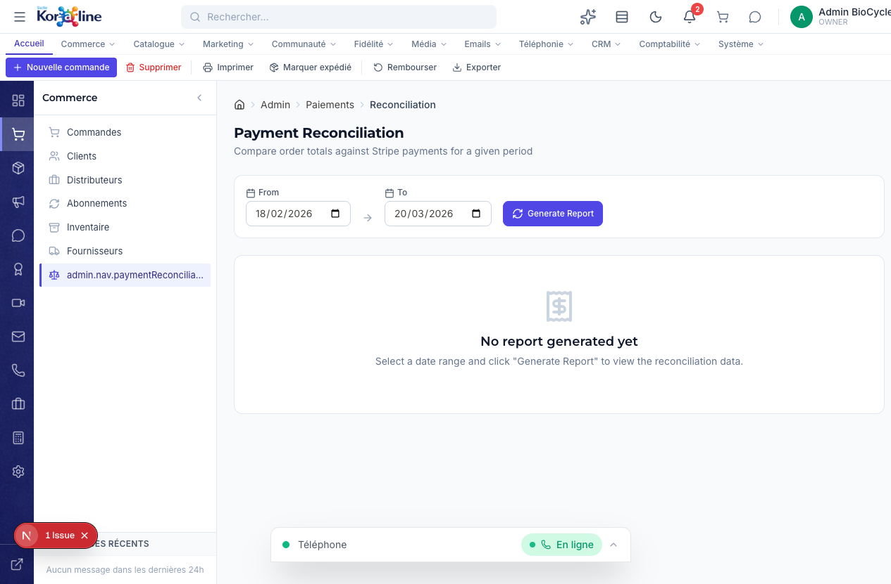

# Reconciliation des Paiements

> **Section**: Commerce > Reconciliation des paiements
> **URL**: `/admin/paiements/reconciliation`
> **Niveau**: Intermediaire a avance
> **Temps de lecture**: ~15 minutes

---

## A quoi sert cette page ?

La page **Reconciliation des paiements** compare les montants de vos commandes dans Koraline avec les paiements reellement recus dans Stripe (votre processeur de paiement). Cela vous permet de detecter les ecarts : commandes payees mais non enregistrees, remboursements non comptabilises, erreurs de paiement, etc.

**En tant que gestionnaire, vous pouvez :**
- Generer un rapport de reconciliation pour une periode donnee
- Voir le total des commandes, revenus, remboursements et revenu net
- Identifier les commandes non reconciliees (ecarts entre Koraline et Stripe)
- Voir le nombre d'erreurs de paiement
- Exporter les commandes non reconciliees en CSV pour investigation

---

## Concepts cles pour les debutants

### Qu'est-ce que la reconciliation financiere ?
La reconciliation, c'est l'acte de verifier que deux systemes ont les memes chiffres. Ici, on compare :
- **Koraline** (votre systeme de commandes) — ce que votre boutique a enregistre
- **Stripe** (votre processeur de paiement) — ce qui a reellement ete debite/credite

Si les deux correspondent : tout va bien. Sinon, il y a un ecart a investiguer.

### Pourquoi c'est important ?
- Detecter les fraudes ou erreurs de paiement
- S'assurer que chaque commande a bien ete payee
- Verifier que les remboursements sont bien appliques des deux cotes
- Preparer votre comptabilite avec des chiffres fiables

---

## Comment y acceder

1. Dans la **barre de navigation horizontale**, cliquez sur **Commerce**
2. Dans le **panneau lateral**, cliquez sur **Reconciliation des paiements** (dernier element)

> **Note** : Le label dans la sidebar peut apparaitre tronque ("admin.nav.paymentReconcilia...") — c'est un bug d'affichage connu.

---

## Vue d'ensemble de l'interface

L'interface est simple et directe :

### 1. Selecteur de periode
Deux champs de date :
- **From** (Du) : Date de debut de la periode a analyser
- **To** (Au) : Date de fin
- Par defaut : les 30 derniers jours

### 2. Bouton "Generate Report"
Cliquez pour lancer l'analyse. Le systeme compare les commandes Koraline avec les transactions Stripe pour la periode selectionnee.

### 3. Rapport (apres generation)
Le rapport affiche :

#### Cartes de statistiques (5 indicateurs)

| Carte | Description |
|-------|-------------|
| **Total commandes** | Nombre de commandes dans la periode |
| **Revenu total** | Somme de tous les montants commandes |
| **Total rembourse** | Montant total des remboursements |
| **Revenu net** | Revenu total - Remboursements |
| **Erreurs de paiement** | Nombre de transactions ayant echoue |

#### Indicateurs de reconciliation

| Indicateur | Description |
|------------|-------------|
| **Reconciliees avec Stripe** | Nombre de commandes dont le montant correspond a une transaction Stripe |
| **Commandes non reconciliees** | Nombre de commandes sans correspondance Stripe (ecarts a investiguer) |

#### Tableau des commandes non reconciliees
Si des ecarts sont detectes, un tableau les liste avec :
- **Numero de commande**
- **Montant total**
- **Statut de paiement** (badge colore : PAID, REFUNDED, PARTIALLY_REFUNDED)
- **Date**

---

## Fonctions detaillees

### 1. Generer un rapport

1. Selectionnez la date de debut dans le champ **From**
2. Selectionnez la date de fin dans le champ **To**
3. Cliquez sur **Generate Report**
4. Attendez quelques secondes (le systeme interroge Stripe)
5. Le rapport s'affiche avec les statistiques et la liste des ecarts

### 2. Investiguer les ecarts

Quand vous voyez des commandes non reconciliees :

1. Notez le numero de commande
2. Allez dans **Commerce > Commandes** et recherchez cette commande
3. Verifiez son statut de paiement
4. Connectez-vous a votre dashboard Stripe et recherchez la meme transaction
5. Identifiez la cause de l'ecart :
   - **Paiement en attente** : Le client a paye mais Stripe n'a pas encore confirme (delai bancaire)
   - **Webhook manque** : Stripe a confirme le paiement mais le webhook n'a pas ete recu par Koraline
   - **Remboursement partiel** : Un remboursement a ete fait dans Stripe mais pas enregistre dans Koraline
   - **Erreur de montant** : Le montant dans Koraline ne correspond pas a celui dans Stripe (rare)

### 3. Exporter les ecarts

1. Apres avoir genere un rapport avec des ecarts
2. Cliquez sur **Exporter CSV** (bouton en haut a droite du tableau)
3. Un fichier CSV est telecharge avec : Numero de commande, Total, Statut, Date
4. Utilisez ce fichier pour votre investigation ou pour votre comptable

---

## Workflows complets

### Scenario 1 : Reconciliation mensuelle (fin de mois)

1. Le dernier jour du mois, allez dans **Paiements > Reconciliation**
2. Selectionnez les dates du 1er au dernier jour du mois
3. Cliquez sur **Generate Report**
4. Si **0 commandes non reconciliees** : tout est en ordre, archivez le rapport
5. Si des ecarts existent :
   - Exportez le CSV
   - Investigez chaque ecart (voir section "Investiguer les ecarts")
   - Corrigez dans Koraline ou Stripe selon le cas
   - Regenerez le rapport pour confirmer la resolution
6. Transmettez le rapport final a votre comptable

### Scenario 2 : Client dit "j'ai paye mais pas recu ma commande"

1. Allez dans **Paiements > Reconciliation**
2. Selectionnez la periode autour de la date d'achat du client
3. Generez le rapport
4. Cherchez le numero de commande dans les "non reconciliees"
5. Si la commande apparait : verifiez dans Stripe si le paiement a bien ete recu
6. Si Stripe confirme le paiement : le probleme est cote Koraline (webhook manque) — marquez manuellement la commande comme payee

---

## FAQ

### Q : A quelle frequence devrais-je faire la reconciliation ?
**R** : Idealement une fois par semaine pour les periodes actives, et obligatoirement une fois par mois pour la cloture comptable.

### Q : Le rapport prend-il en compte les taxes ?
**R** : Oui, les montants incluent les taxes. Le revenu total correspond au montant total debite au client.

### Q : Que faire si Stripe montre un paiement que Koraline ne connait pas ?
**R** : C'est probablement un paiement dont le webhook n'a pas ete recu. Verifiez dans Stripe > Developers > Webhooks si des evenements ont echoue. Vous pouvez les renvoyer manuellement.

### Q : Les remboursements partiels sont-ils detectes ?
**R** : Oui, le statut PARTIALLY_REFUNDED (badge orange) identifie les remboursements partiels.

---

## Glossaire

| Terme | Definition |
|-------|-----------|
| **Reconciliation** | Verification que les chiffres de deux systemes correspondent |
| **Stripe** | Processeur de paiement en ligne utilise par BioCycle Peptides |
| **Webhook** | Notification automatique envoyee par Stripe a Koraline quand un evenement se produit (paiement, remboursement, etc.) |
| **Revenu net** | Revenu total moins les remboursements |
| **Ecart** | Difference entre ce que Koraline enregistre et ce que Stripe rapporte |

---

## Pages liees

- [Commandes](01-commandes.md) — Detail des commandes individuelles
- [Inventaire](05-inventaire.md) — Reconciliation du stock (different de la reconciliation financiere)
- Section **Comptabilite** — Rapports financiers detailles
