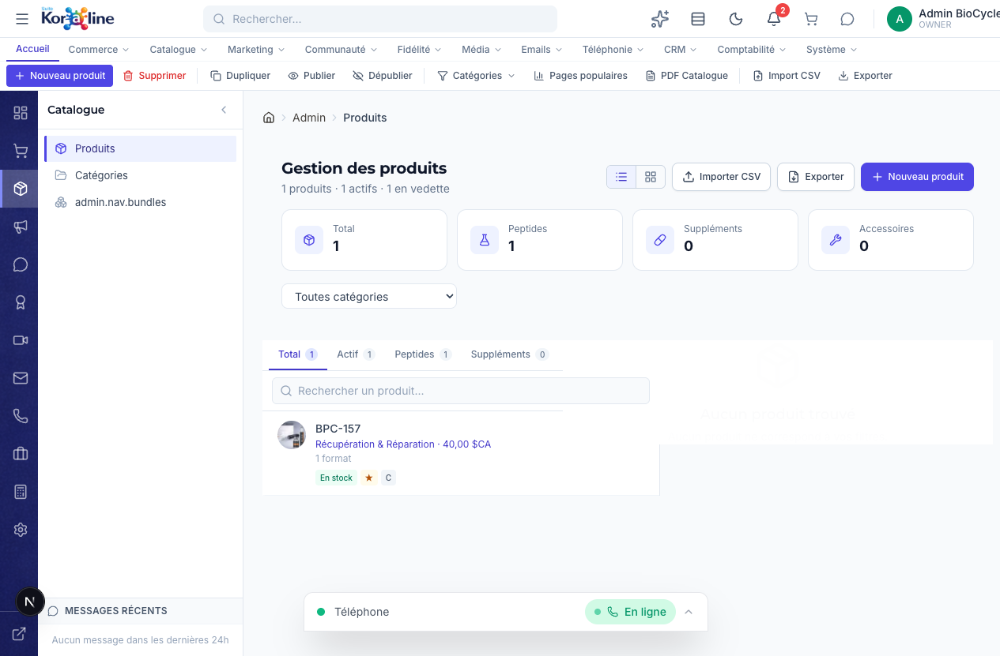

# Gestion des Produits

> **Section**: Catalogue > Produits
> **URL**: `/admin/produits`
> **Niveau**: Debutant a avance
> **Temps de lecture**: ~30 minutes

---

## A quoi sert cette page ?

La page **Produits** est le catalogue complet de tout ce que vous vendez. C'est ici que vous creez, modifiez, publiez et organisez vos peptides, supplements et accessoires.

**En tant que gestionnaire, vous pouvez :**
- Voir tous vos produits avec leur statut, prix, stock et categorie
- Basculer entre vue liste et vue grille
- Filtrer par categorie, statut (actif/total), type (peptides/supplements)
- Rechercher un produit par nom
- Creer un nouveau produit avec tous ses details (nom, description, prix, formats, images, SEO)
- Modifier un produit existant
- Dupliquer un produit (gain de temps pour des produits similaires)
- Publier ou depublier un produit (le rendre visible ou invisible sur la boutique)
- Supprimer un produit
- Importer des produits depuis un fichier CSV
- Exporter le catalogue au format CSV
- Generer un catalogue PDF
- Voir les pages les plus populaires du catalogue
- Voir la classification ABC (quels produits generent le plus de revenus)

---

## Concepts cles pour les debutants

### Types de produits
BioCycle Peptides vend 3 types de produits :

| Type | Icone | Description |
|------|-------|-------------|
| **Peptide** | Fiole | Peptides synthetiques pour la recherche (BPC-157, TB-500, etc.) |
| **Supplement** | Pilule | Supplements nutritionnels |
| **Accessoire** | Outil | Accessoires (seringues, eau bacteriostatique, etc.) |

### Formats
Un produit peut avoir **plusieurs formats** (variantes). Par exemple, le BPC-157 peut exister en :
- 5mg Vial — 40,00 $CA
- 10mg Vial — 70,00 $CA

Chaque format a son propre prix, stock, SKU et disponibilite.

### Classification ABC
Le systeme classe automatiquement vos produits selon leur contribution au revenu :
- **A** (etoile) : Les 20% de produits qui generent 80% du revenu — vos meilleurs vendeurs
- **B** : Les produits a contribution moyenne
- **C** : Les produits a faible contribution — a surveiller

### Statuts d'un produit
| Statut | Description |
|--------|-------------|
| **Actif** | Visible sur la boutique, les clients peuvent l'acheter |
| **Inactif** | Cache de la boutique, invisible pour les clients |
| **En vedette** | Mis en avant sur la page d'accueil ou dans les recommandations |
| **Nouveau** | Marque comme nouveau produit (badge "Nouveau" sur la boutique) |
| **Bestseller** | Marque comme produit populaire |

---

## Comment y acceder

1. Dans la **barre de navigation horizontale**, cliquez sur **Catalogue**
2. Dans le **panneau lateral**, cliquez sur **Produits** (1er element)

Ou cliquez directement sur l'icone **Catalogue** (3e icone) dans le rail de navigation a gauche.

---

## Vue d'ensemble de l'interface



### La barre de ruban (Ribbon)

| Bouton | Fonction |
|--------|----------|
| **Nouveau produit** | Creer un nouveau produit |
| **Supprimer** | Supprimer le produit selectionne |
| **Dupliquer** | Creer une copie du produit selectionne |
| **Publier** | Activer le produit selectionne (visible sur la boutique) |
| **Depublier** | Desactiver le produit (cache de la boutique) |
| **Categories** | Filtrer par categorie (menu deroulant) |
| **Pages populaires** | Voir les produits les plus visites |
| **PDF Catalogue** | Generer un catalogue PDF de tous les produits |
| **Import CSV** | Importer des produits depuis un fichier CSV |
| **Exporter** | Telecharger la liste des produits en CSV |

### Les cartes de statistiques (4 cartes)

| Carte | Description |
|-------|-------------|
| **Total** | Nombre total de produits |
| **Peptides** | Nombre de peptides |
| **Supplements** | Nombre de supplements |
| **Accessoires** | Nombre d'accessoires |

### Vue liste / Vue grille
Deux boutons en haut a droite permettent de basculer :
- **Vue liste** (icone lignes) : Affichage maitre/detail avec panneau de detail a droite
- **Vue grille** (icone grille) : Affichage en cartes, plus visuel

### Selecteur de categorie
Un menu deroulant "Toutes les categories" permet de filtrer par categorie.

### Onglets de filtre
- **Total** — Tous les produits
- **Actif** — Seulement les produits publies
- **Peptides** — Seulement les peptides
- **Supplements** — Seulement les supplements

---

## Fonctions detaillees

### 1. Consulter un produit

1. Cliquez sur un produit dans la liste
2. Le panneau de detail a droite affiche :
   - **Image** du produit
   - **Nom** et categorie
   - **Prix** de base
   - **Badges** : En stock/Rupture, Vedette, Classification ABC
   - **Formats** : Liste de toutes les variantes avec prix, stock, disponibilite
   - **Boutons d'action** : Modifier, Voir sur la boutique, Supprimer

### 2. Creer un nouveau produit

1. Cliquez sur **Nouveau produit** dans le ruban (ou le bouton bleu en haut a droite)
2. Vous etes redirige vers la page de creation `/admin/produits/new`
3. Remplissez les champs :

| Section | Champs |
|---------|--------|
| **Informations generales** | Nom, Description, Type (Peptide/Supplement/Accessoire), Categorie |
| **Prix et formats** | Prix de base, Formats (nom, prix, SKU, stock), Seuil d'alerte stock |
| **Images** | Image principale, Galerie d'images |
| **Marqueurs** | Actif, En vedette, Nouveau, Bestseller, Purete (%) |
| **SEO** | Slug (URL), Meta title, Meta description |

4. Cliquez sur **Enregistrer**

### 3. Modifier un produit

1. Selectionnez le produit dans la liste
2. Cliquez sur **Modifier** (icone crayon) dans le panneau de detail
3. Vous etes redirige vers `/admin/produits/{id}/edit`
4. Modifiez les champs souhaites
5. Enregistrez

### 4. Dupliquer un produit

Utile pour creer des produits similaires sans tout re-saisir.

1. Selectionnez le produit a dupliquer
2. Cliquez sur **Dupliquer** dans le ruban
3. Une copie est creee avec le suffixe "(copie)" dans le nom
4. Modifiez le nom, prix et autres details specifiques
5. Enregistrez

### 5. Publier / Depublier

- **Publier** : Rend le produit visible sur la boutique. Les clients peuvent le voir et l'acheter.
- **Depublier** : Cache le produit de la boutique. Il reste dans l'admin mais est invisible pour les clients.

1. Selectionnez le produit
2. Cliquez sur **Publier** ou **Depublier** dans le ruban

### 6. Importer depuis CSV

Pour ajouter plusieurs produits d'un coup.

1. Cliquez sur **Import CSV** dans le ruban (ou le bouton en haut a droite)
2. Selectionnez votre fichier CSV
3. Le systeme valide et importe les produits
4. Un rapport d'import s'affiche (produits crees, erreurs eventuelles)

### 7. Exporter le catalogue

1. Cliquez sur **Exporter** dans le ruban (ou le bouton en haut a droite)
2. Un fichier CSV est telecharge avec tous les produits et leurs details

### 8. Generer un catalogue PDF

1. Cliquez sur **PDF Catalogue** dans le ruban
2. Un PDF professionnel est genere avec tous les produits actifs
3. Utile pour envoyer a des distributeurs ou afficher en salon

---

## Workflows complets

### Scenario 1 : Ajouter un nouveau peptide au catalogue

1. Allez dans **Catalogue > Produits**
2. Cliquez sur **Nouveau produit**
3. Selectionnez le type **Peptide**
4. Renseignez nom, description scientifique, categorie
5. Ajoutez les formats : 5mg (40$), 10mg (70$)
6. Uploadez l'image du produit
7. Cochez "En vedette" si c'est un nouveau produit phare
8. Remplissez les champs SEO (slug, meta description)
9. Enregistrez
10. Verifiez sur la boutique que le produit apparait correctement

### Scenario 2 : Identifier les produits a faible performance

1. Allez dans **Catalogue > Produits**
2. Regardez la classification ABC dans les badges de chaque produit
3. Les produits classes **C** sont ceux qui generent le moins de revenus
4. Pour chaque produit C, decidez :
   - **Garder** : Le produit a une valeur strategique malgre les faibles ventes
   - **Promouvoir** : Creer une campagne marketing pour booster les ventes
   - **Retirer** : Depublier le produit s'il n'a aucun interet strategique

### Scenario 3 : Mettre a jour les prix de tous les produits

1. Cliquez sur **Exporter** pour obtenir le CSV actuel
2. Ouvrez le CSV dans Excel
3. Modifiez les prix
4. Sauvegardez le CSV
5. Cliquez sur **Import CSV** pour re-importer les donnees mises a jour

---

## FAQ

### Q : Quelle est la difference entre "prix de base" et "prix du format" ?
**R** : Le prix de base est le prix affiche par defaut. Les formats ont chacun leur propre prix qui peut etre different. C'est le prix du format qui est facture au client.

### Q : Si je depublie un produit, les commandes en cours sont-elles affectees ?
**R** : Non. Les commandes existantes ne sont pas impactees. Seules les nouvelles commandes sont impossibles.

### Q : Comment les produits "En vedette" sont-ils affiches ?
**R** : Ils apparaissent dans la section mise en avant sur la page d'accueil de la boutique et dans les recommandations.

### Q : Le stock est-il gere ici ou dans Inventaire ?
**R** : Le stock est visible ici (dans les formats), mais la gestion complete (ajustements, reappro, reconciliation) se fait dans **Commerce > Inventaire**.

---

## Strategie expert : Guide de redaction des fiches produits peptides

### Structure d'une fiche produit optimale

Une fiche produit de peptide doit contenir deux types de description : scientifique (pour la credibilite) et marketing (pour la conversion).

#### Description scientifique (section technique)

Chaque fiche peptide doit inclure les informations suivantes :
- **Nom complet** : nom courant + nom IUPAC si disponible (ex: BPC-157, Body Protection Compound-157)
- **Sequence d'acides amines** : sequence complete en code a une lettre (ex: Gly-Glu-Pro-Pro-Pro-Gly-Lys-Pro-Ala-Asp-Asp-Ala-Gly-Leu-Val)
- **Poids moleculaire** : en Daltons (ex: 1 419,53 Da)
- **Formule moleculaire** : (ex: C62H98N16O22)
- **Purete** : pourcentage minimum garanti (ex: superieure ou egale a 98% par HPLC)
- **Forme physique** : poudre lyophilisee blanche
- **Solubilite** : solvants compatibles (ex: soluble dans l'eau bacteriostatique, solution saline)
- **Conditions de stockage** : temperature, humidite, lumiere
- **Numero CAS** : si disponible (ex: 137525-51-0 pour le BPC-157)

#### Description marketing (section commerciale)

La description marketing doit etre claire, factuelle et orientee vers les benefices de recherche :
- **Titre accrocheur** : "BPC-157 — Le peptide de reference pour la recherche en reparation tissulaire"
- **Introduction** (2-3 phrases) : resumer le peptide, son origine et son domaine de recherche principal
- **Domaines de recherche** (liste a puces) : lister les axes de recherche publies (avec references si possible)
- **Formats disponibles** : tableau avec dosages, prix et quantites
- **Instructions de manipulation** : reconstitution, stockage post-reconstitution
- **Avertissement reglementaire** : mention obligatoire (voir section Conformite ci-dessous)

### Modele de description type

```
[NOM DU PEPTIDE] — [PHRASE D'ACCROCHE]

Le [nom] est un peptide synthetique de [nombre] acides amines etudie dans le
cadre de recherches sur [domaine]. Identifie pour la premiere fois par [reference],
il fait l'objet de nombreuses publications scientifiques.

Domaines de recherche :
- [Domaine 1] : [description courte de l'axe de recherche]
- [Domaine 2] : [description courte]
- [Domaine 3] : [description courte]

Specifications techniques :
- Sequence : [sequence]
- Poids moleculaire : [poids] Da
- Purete : ≥98% (HPLC)
- Forme : Poudre lyophilisee

Ce produit est destine exclusivement a la recherche scientifique in vitro et in vivo.
Il n'est pas approuve pour un usage humain ou veterinaire.
```

---

## Strategie expert : Optimisation SEO des fiches produits

### Recherche de mots-cles longue traine

Les clients potentiels cherchent des peptides avec des requetes tres specifiques. Voici les patterns de mots-cles les plus performants pour le marche canadien.

| Pattern de recherche | Exemples | Volume relatif |
|---------------------|----------|----------------|
| [peptide] + [dosage] + [format] | "BPC-157 5mg vial" | Eleve |
| [peptide] + "buy" + [pays] | "buy TB-500 Canada" | Eleve |
| [peptide] + "research" + [domaine] | "CJC-1295 research muscle growth" | Moyen |
| [peptide] + "vs" + [autre peptide] | "BPC-157 vs TB-500" | Moyen |
| [peptide] + "purity" + [pourcentage] | "BPC-157 99% purity" | Moyen |
| [peptide] + "review" | "Ipamorelin review 2026" | Moyen a eleve |
| "peptides for research" + [pays/ville] | "peptides for research Quebec" | Faible mais qualifie |

### Optimisation des champs SEO dans Koraline

| Champ | Regle | Exemple pour BPC-157 5mg |
|-------|-------|--------------------------|
| **Slug** | Nom du peptide + format, tout en minuscules, tirets | `bpc-157-5mg-vial` |
| **Meta title** | [Peptide] [Dosage] — [Benefice] — BioCycle Peptides (moins de 60 caracteres) | "BPC-157 5mg Vial — Research Peptide — BioCycle Peptides" |
| **Meta description** | 150-160 caracteres, inclure le peptide, le dosage, la purete et un appel a l'action | "Buy BPC-157 5mg vial, 98%+ purity HPLC tested. Fast shipping across Canada. Research-grade peptides by BioCycle Peptides." |

### Contenu supplementaire pour le SEO

Pour chaque peptide populaire, creer du contenu additionnel :
1. **Article de blog** : "Guide complet du [peptide] pour la recherche" (1 500-2 000 mots)
2. **FAQ produit** : 5-10 questions frequentes specifiques au peptide
3. **Comparatif** : "[Peptide A] vs [Peptide B] : lequel choisir pour votre recherche ?"

---

## Strategie expert : Pricing par format

### Strategie de prix par dosage

Le pricing par format suit generalement une logique de **remise au volume** : le prix au milligramme diminue quand le dosage augmente, incitant le client a acheter le plus grand format.

| Format | Prix | Prix/mg | Remise implicite |
|--------|------|---------|-----------------|
| 2mg | 25 $CA | 12,50 $CA/mg | Prix de base (reference) |
| 5mg | 40 $CA | 8,00 $CA/mg | -36% par rapport au 2mg |
| 10mg | 70 $CA | 7,00 $CA/mg | -44% par rapport au 2mg |
| 20mg | 120 $CA | 6,00 $CA/mg | -52% par rapport au 2mg |

**Regle de base** : chaque passage au format superieur doit offrir une economie de 10-15% par unite de mesure. Cela motive le client a acheter un format plus grand tout en preservant la marge.

### Pricing strategique par type de produit

| Type de produit | Marge brute cible | Strategie |
|-----------------|-------------------|-----------|
| Peptides populaires (BPC-157, TB-500) | 50-60% | Prix competitifs, volume eleve |
| Peptides specialises (rares, nouveaux) | 65-75% | Prix premium, positionnement expert |
| Accessoires (seringues, eau bacterio) | 40-50% | Prix bas, produits d'appel pour les bundles |
| Supplements | 55-65% | Prix moyen, marge stable |

---

## Strategie expert : Conformite Sante Canada

### Regle fondamentale

Les peptides vendus par BioCycle Peptides sont destines **exclusivement a la recherche scientifique**. Il est **interdit par la loi** de faire des claims (allegations) medicaux, therapeutiques ou de sante sur ces produits.

### Ce qu'il ne faut JAMAIS ecrire

| Interdit | Pourquoi | Alternative autorisee |
|----------|----------|----------------------|
| "Guerit les blessures" | Claim medical | "Etudie dans le cadre de la recherche sur la reparation tissulaire" |
| "Aide a perdre du poids" | Claim de sante | "Objet de recherches dans le domaine du metabolisme" |
| "Augmente la masse musculaire" | Claim de performance | "Etudie pour son role potentiel dans la croissance des tissus" |
| "Traite l'inflammation" | Claim therapeutique | "Utilise en recherche scientifique sur les processus inflammatoires" |
| "Anti-age" | Claim cosmetique | "Etudie pour ses proprietes dans la recherche sur le vieillissement cellulaire" |

### Mentions obligatoires sur chaque fiche produit

Chaque fiche produit doit afficher de maniere visible :

1. **"Pour usage en recherche uniquement"** ("For research use only")
2. **"Non approuve pour usage humain ou veterinaire"** ("Not approved for human or veterinary use")
3. **"Non destine a la consommation"** ("Not for human consumption")

Ces mentions doivent apparaitre :
- Dans la description du produit
- Sur l'etiquette physique du produit
- Sur la facture et le bon de livraison
- Dans les emails de confirmation de commande

### Risques en cas de non-conformite

- Avertissement de Sante Canada
- Saisie des produits
- Amende pouvant atteindre 5 millions de dollars
- Poursuites penales dans les cas graves
- Perte de la capacite a operer en tant que vendeur de peptides

---

## Glossaire

| Terme | Definition |
|-------|-----------|
| **SKU** | Stock Keeping Unit — code unique pour un format de produit |
| **Slug** | Partie de l'URL du produit (ex: "bpc-157" dans /produits/bpc-157) |
| **Format** | Variante d'un produit (taille, dosage, conditionnement) |
| **Classification ABC** | Classement des produits par contribution au revenu (A=80%, B=15%, C=5%) |
| **En vedette** | Produit mis en avant sur la page d'accueil |
| **Meta description** | Texte court affiche dans les resultats Google |

---

## Pages liees

- [Categories](02-categories.md) — Organiser les produits par categories
- [Bundles](03-bundles.md) — Creer des lots de produits a prix reduit
- [Inventaire](../02-commerce/05-inventaire.md) — Gestion du stock
- [Commandes](../02-commerce/01-commandes.md) — Commandes contenant ces produits
