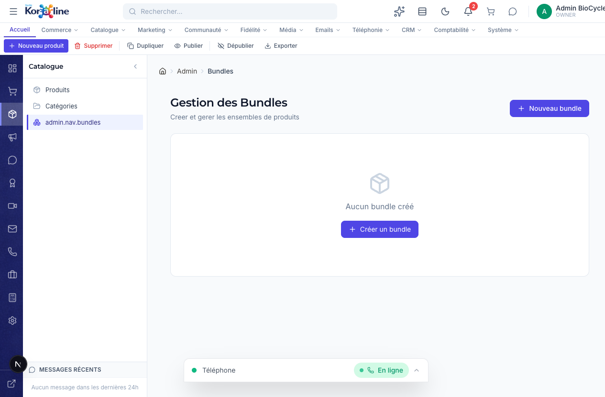

# Gestion des Bundles (Lots de produits)

> **Section**: Catalogue > Bundles
> **URL**: `/admin/bundles`
> **Niveau**: Debutant a intermediaire
> **Temps de lecture**: ~12 minutes

---

## A quoi sert cette page ?

La page **Bundles** permet de creer des **lots de produits** vendus ensemble a prix reduit. C'est une strategie commerciale puissante pour augmenter le panier moyen et ecouler des produits complementaires.

**En tant que gestionnaire, vous pouvez :**
- Voir tous les bundles existants avec leur prix, nombre de produits et statut
- Creer un nouveau bundle (nom, description, produits inclus, prix special)
- Modifier un bundle existant
- Publier ou depublier un bundle
- Dupliquer un bundle
- Exporter la liste des bundles

---

## Concepts cles pour les debutants

### Qu'est-ce qu'un bundle ?
Un bundle (ou lot), c'est un ensemble de produits vendus ensemble a un prix inferieur a la somme des prix individuels. Par exemple :
- **Kit Recuperation** : BPC-157 (40$) + TB-500 (55$) + Eau bacteriostatique (15$)
  - Prix individuel total : 110$
  - Prix bundle : 89,99$ (**economie de 20$**)

### Prix compare vs prix du bundle
| Terme | Description |
|-------|-------------|
| **Prix du bundle** | Le prix reel que le client paie |
| **Prix compare** | Le prix "barre" affiche (somme des prix individuels) — montre l'economie |

### Pourquoi creer des bundles ?
- **Augmenter le panier moyen** — Les clients achetent plus en un seul achat
- **Ventes croisees** — Faire decouvrir des produits complementaires
- **Ecouler du stock** — Inclure des produits a faible rotation dans un bundle attractif
- **Simplifier l'achat** — Le client n'a pas a chercher les produits un par un

---

## Comment y acceder

1. Dans la **barre de navigation horizontale**, cliquez sur **Catalogue**
2. Dans le **panneau lateral**, cliquez sur **Bundles** (3e element)

---

## Vue d'ensemble de l'interface

L'interface est simple :
- Un **titre** avec sous-titre explicatif
- Un bouton **Nouveau bundle** en haut a droite
- Si aucun bundle : un message d'etat vide avec un bouton pour creer le premier
- Si des bundles existent : une **grille de cartes** (1 carte par bundle)

### La barre de ruban

| Bouton | Fonction |
|--------|----------|
| **Nouveau produit** | Creer un nouveau bundle (redirige vers `/admin/bundles/new`) |
| **Supprimer** | Supprimer le bundle selectionne |
| **Dupliquer** | Copier un bundle existant |
| **Publier** | Rendre le bundle visible sur la boutique |
| **Depublier** | Cacher le bundle de la boutique |
| **Exporter** | Telecharger la liste en CSV |

### Carte d'un bundle
Chaque bundle est affiche sous forme de carte avec :
- **Nom** du bundle
- **Description** courte
- **Prix** du bundle + prix compare (barre)
- **Nombre de produits** inclus
- **Statut** : Actif (visible) ou Inactif
- **Boutons** : Modifier, Voir sur la boutique

---

## Fonctions detaillees

### 1. Creer un bundle

1. Cliquez sur **Nouveau bundle** (bouton bleu en haut a droite)
2. Vous etes redirige vers `/admin/bundles/new`
3. Remplissez le formulaire :

| Champ | Obligatoire | Description |
|-------|-------------|-------------|
| **Nom** | Oui | Nom du bundle affiche sur la boutique (ex: "Kit Recuperation Pro") |
| **Slug** | Auto-genere | URL du bundle |
| **Description** | Non | Description marketing du bundle |
| **Prix** | Oui | Prix de vente du bundle (inferieur a la somme des produits) |
| **Prix compare** | Non | Prix barre affiche a cote (montre l'economie au client) |
| **Produits** | Oui | Selectionnez les produits a inclure dans le bundle |
| **Actif** | Oui | Visible sur la boutique ? |

4. Cliquez sur **Enregistrer**

### 2. Modifier un bundle

1. Cliquez sur l'icone **Modifier** (crayon) sur la carte du bundle
2. Le formulaire de modification s'ouvre
3. Ajustez les champs (prix, produits inclus, description)
4. Enregistrez

### 3. Publier / Depublier

- Cliquez sur **Publier** dans le ruban pour rendre le bundle visible
- Cliquez sur **Depublier** pour le cacher temporairement

---

## Workflows complets

### Scenario : Creer un bundle promotionnel pour le Black Friday

1. Allez dans **Catalogue > Bundles**
2. Cliquez sur **Nouveau bundle**
3. Nom : "Black Friday — Pack Peptides Essentiels"
4. Description : "3 de nos meilleurs peptides au prix de 2 ! Offre limitee."
5. Ajoutez les produits : BPC-157 + TB-500 + CJC-1295
6. Prix compare : 165$ (somme des prix individuels)
7. Prix bundle : 109,99$
8. Laissez "Inactif" pour le moment
9. Enregistrez
10. Le jour du Black Friday : revenez et cliquez sur **Publier**
11. Apres l'evenement : cliquez sur **Depublier**

---

## FAQ

### Q : Combien de produits puis-je mettre dans un bundle ?
**R** : Il n'y a pas de limite technique. Cependant, pour des raisons marketing, 2 a 5 produits est ideal.

### Q : Le stock est-il decremente pour chaque produit du bundle quand un client achete ?
**R** : Oui. Chaque produit du bundle est decremente individuellement dans l'inventaire.

### Q : Puis-je inclure le meme produit plusieurs fois dans un bundle ?
**R** : Oui, avec des quantites differentes si necessaire.

### Q : Les bundles apparaissent-ils dans les categories de produits ?
**R** : Les bundles ont leur propre section sur la boutique, mais peuvent aussi etre lies a une categorie "Bundles".

---

## Strategie expert : Psychologie du pricing des bundles

### Ancrage de prix

L'ancrage est un biais cognitif ou le client utilise la premiere information de prix comme reference pour evaluer les suivantes. Pour les bundles, cela se traduit par :

1. **Toujours afficher le prix individuel barre** : le client voit d'abord le prix total "normal" (ex: 165 $CA), puis le prix bundle (109,99 $CA). L'economie percue est immediate.
2. **Afficher l'economie en dollars ET en pourcentage** : "Economisez 55,01 $CA (33%)" est plus percutant que seulement l'un des deux.
3. **Utiliser des prix se terminant par ,99 ou ,95** : psychologiquement, 109,99 $CA est percu comme significativement moins cher que 110,00 $CA (effet de chiffre de gauche).

### Effet de rarete

La rarete augmente la valeur percue et l'urgence d'achat. Appliquer ces techniques aux bundles :

| Technique | Exemple | Impact sur les ventes |
|-----------|---------|----------------------|
| Offre limitee dans le temps | "Bundle disponible jusqu'au 31 mars" | Augmente l'urgence, +15-25% de conversions |
| Quantite limitee | "Seulement 50 kits disponibles" | Cree l'exclusivite, +10-20% de conversions |
| Saisonnier | "Pack Ete — disponible uniquement en mai-juin" | Nouveaute et exclusivite combinee |
| Bonus temporaire | "Commandez ce bundle cette semaine : seringues offertes" | Incitation supplementaire, +20-30% |

### Structure de prix optimale pour les bundles

| Nombre de produits | Remise recommandee | Marge preservee |
|-------------------|--------------------|-----------------|
| 2 produits | 10-15% | Bonne |
| 3 produits | 15-20% | Acceptable |
| 4-5 produits | 20-25% | Attention a la marge |
| 6+ produits | 25-30% | Marge faible, utiliser comme produit d'appel uniquement |

---

## Strategie expert : Cross-sell eprouve pour les peptides

### Combinaisons de produits a forte synergie

Les bundles les plus performants combinent des produits que les clients acheteraient naturellement ensemble. Voici les combinaisons eprouvees pour le marche des peptides.

| Bundle | Produits inclus | Logique | Prix individuel | Prix bundle suggere |
|--------|----------------|---------|-----------------|---------------------|
| **Kit Demarrage Recherche** | 1 peptide au choix + eau bacteriostatique + seringues | Le debutant a besoin de tout le materiel | 70-85 $CA | 59,99 $CA |
| **Kit Recuperation Avancee** | BPC-157 5mg + TB-500 5mg + eau bacteriostatique | Synergie recherche reparation | 110-120 $CA | 89,99 $CA |
| **Kit Croissance Complet** | CJC-1295 + Ipamorelin + seringues | Combinaison classique GH research | 130-150 $CA | 109,99 $CA |
| **Kit Anti-Age Premium** | Epitalon + GHK-Cu + eau bacteriostatique | Recherche longevite | 140-160 $CA | 119,99 $CA |
| **Pack Reapprovisionnement** | 3x BPC-157 5mg + 2x eau bacteriostatique | Economie de volume pour les clients reguliers | 135-150 $CA | 109,99 $CA |

### Accessoires a inclure systematiquement

L'inclusion d'accessoires dans les bundles est une strategie doublement efficace : elle augmente la valeur percue du bundle tout en eliminant un frein a l'achat (le client n'a pas besoin de chercher les accessoires separement).

| Accessoire | Cout pour BioCycle | Valeur percue client | A inclure dans |
|------------|-------------------|---------------------|----------------|
| Eau bacteriostatique 30ml | 3-5 $CA | 12-15 $CA | Tout bundle avec peptides lyophilises |
| Seringues insuline (pack de 10) | 2-4 $CA | 8-12 $CA | Kits demarrage |
| Tampons alcool (pack de 20) | 1-2 $CA | 5 $CA | Tous les bundles (cout negligeable) |
| Fiole vide sterile | 1-3 $CA | 5-8 $CA | Bundles avec peptides en poudre libre |

---

## Strategie expert : Saisonnalite des promotions bundles

### Calendrier promotionnel annuel

Le marche des peptides de recherche et supplements suit un calendrier saisonnier previsible. Planifiez vos bundles promotionnels en consequence.

| Periode | Evenement | Type de bundle a promouvoir | Remise suggeree |
|---------|-----------|---------------------------|----------------|
| Janvier | Resolutions du Nouvel An | Kits demarrage, bundles "decouverte", kits complets | 15-20% |
| Fevrier | Periode creuse | Bundle fidelite (offre reservee aux clients existants) | 10% + livraison gratuite |
| Mars-Avril | Printemps, preparation ete | Bundles metabolisme et composition | 15% |
| Mai | Pre-ete | Bundles melanotane, performance | 15-20% |
| Juin-Aout | Ete | Bundles populaires (BPC-157, TB-500), moins de promotions necessaires | 10% ou aucune remise |
| Septembre | Rentree | Nouveaux bundles, nouvelles gammes | Prix de lancement |
| Octobre | Pre-Black Friday | Teaser : "inscrivez-vous pour acceder aux offres Black Friday" | Pas de remise encore |
| Novembre | Black Friday / Cyber Monday | Meilleurs bundles de l'annee, remises maximales | 25-30% |
| Decembre | Fetes, cadeaux | Coffrets cadeaux, bundles premium | 15-20% |

### Regles de gestion des bundles saisonniers dans Koraline

1. **Preparer le bundle a l'avance** : creer le bundle 2-3 semaines avant la date prevue avec le statut **Inactif**
2. **Publier le jour J** : cliquer sur **Publier** dans le ruban le jour du lancement de la promotion
3. **Depublier a la fin** : des que la promotion est terminee, cliquer sur **Depublier** pour retirer le bundle de la boutique
4. **Ne pas supprimer** : garder les bundles saisonniers inactifs pour pouvoir les reutiliser l'annee suivante en les dupliquant et ajustant les prix
5. **Analyser les resultats** : apres chaque promotion, verifier combien de bundles ont ete vendus via **Commerce > Commandes** pour decider si l'offre sera reconduite

### Mesure de performance des bundles

| Indicateur | Comment le calculer | Cible |
|-----------|-------------------|-------|
| Taux de conversion bundle | Ventes bundle / Visites page bundle | Plus de 5% |
| Part des bundles dans le CA | CA bundles / CA total | 15-25% |
| Augmentation du panier moyen | Panier moyen avec bundles - Panier moyen sans | Plus de 20% d'augmentation |
| Taux de cannibalisation | Ventes produit individuel pendant la promo vs periode normale | Moins de 15% de baisse |

---

## Glossaire

| Terme | Definition |
|-------|-----------|
| **Bundle** | Lot de produits vendus ensemble a prix reduit |
| **Prix compare** | Prix original barre (montre l'economie au client) |
| **Vente croisee** | Strategie de vente de produits complementaires |

---

## Pages liees

- [Produits](01-produits.md) — Les produits individuels qui composent les bundles
- [Categories](02-categories.md) — Categorie "Bundles" dans le catalogue
- [Commandes](../02-commerce/01-commandes.md) — Commandes contenant des bundles
